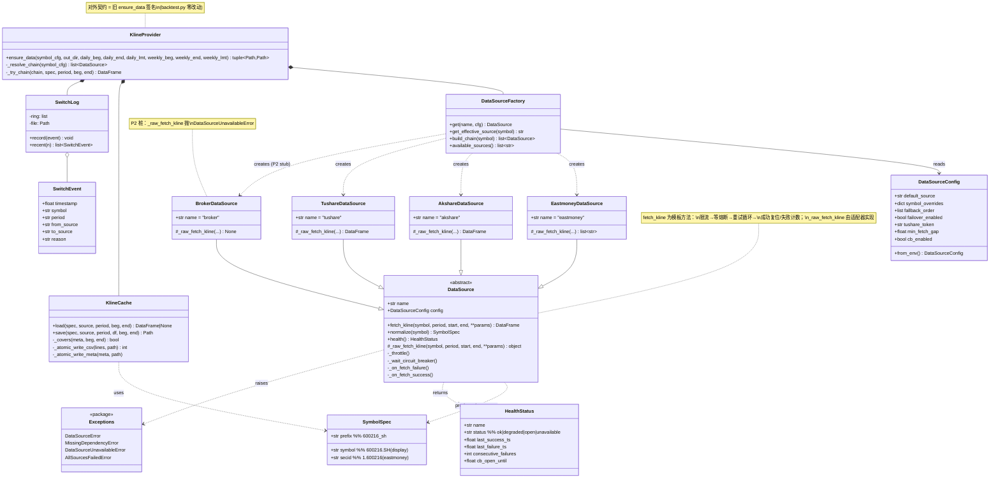
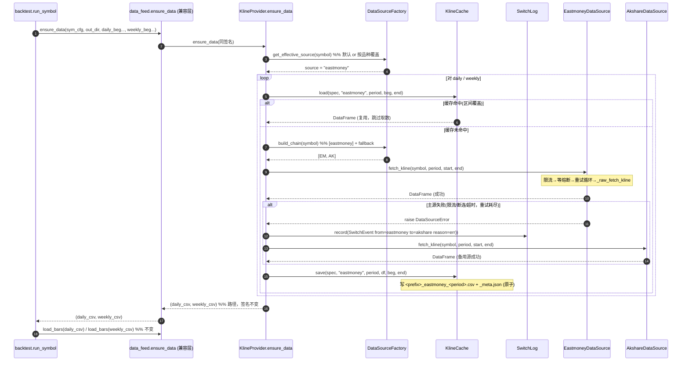
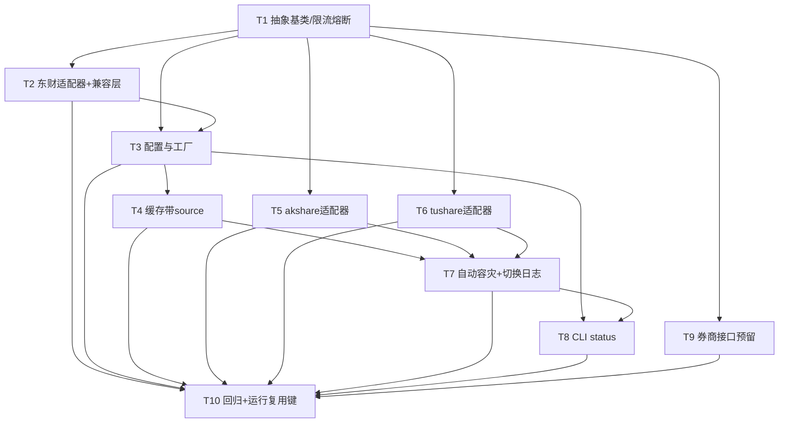

# Strategy Lab 多数据源抽象层 — 系统架构设计

> 文档类型：架构设计 + 任务分解（**不含实现代码**）
> 作者：架构师 高见远
> 版本：v0.1（草案，待主理人过目）
> 关联 PRD：许清楚《多数据源接入（数据源抽象层）PRD v0.1》(`docs/multidatasource-prd.md`)
> 关联现状：`src/strategylab/engine/data_feed.py`（东财硬编码 `push2his`）

---

## 0. 设计原则与硬约束

| 约束 | 说明 |
|------|------|
| **硬约束（P0-2）** | 抽象层重构后，**回测行为不回退**。东财作为默认源，其既有行为（qfq 前复权、klt=101/102、限流 0.3s、熔断阈值 8 次/冷却 30s 翻倍上限 600s、区间覆盖缓存、原子写 CSV）必须 100% 保留。 |
| **复用既有机制** | `normalize_symbol` 符号归一化、`<prefix>_<period>_meta.json` 区间覆盖缓存、进程内 symbol 锁、临时文件 + `os.replace` 原子写，一律**复用机制、仅把"取数"委派给适配器**。 |
| **调用方零改动优先** | `backtest.py` 使用的 `normalize_symbol` / `ensure_data(symbol_cfg, out_dir, …) -> (daily_csv, weekly_csv)` / `load_bars` 签名与返回语义**保持稳定**；通过 `data_feed.py` 兼容层（re-export shim）实现，使其无需改动。 |
| **无新增核心依赖** | 核心栈维持 `标准库 + pandas + SQLAlchemy + python-dotenv`；`akshare`/`tushare` 为**可选依赖（extras）**，缺依赖明确报错、不静默失败。不引入前端框架、不引入消息队列/中间件。 |
| **语言** | 简体中文；结构化输出（Mermaid / 表格 / 分层列表）。 |

---

## 1. 实现方案 + 框架选型

### 1.1 核心难点分析

1. **取数与通用能力耦合**：现有 `fetch_kline` 把"东财 push2his 写法"和"重试/限流/熔断"焊死在一起，无法插拔其他源。
2. **限流/熔断是跨源共性**：重试退避、瞬时错误判定、全局限流、熔断冷却——逻辑与具体源无关，应下沉为抽象层统一能力。
3. **缓存需区分数据源**：同一 `symbol`（如 `600216.SH`）在东财与 tushare 的 K 线可能存在细微差异，复用缓存必须带 `source` 标识，否则脏数据。
4. **容灾要可观测**：主源被 IP 限流时，要能按序切备用源，并记录"源/时间/原因"供 CLI 排查。
5. **零回归**：8 并发批量回测不能因重构而行为退化或触发更多限流。

### 1.2 架构模式选型

采用 **「抽象基类（模板方法）+ 适配器 + 工厂 + 容灾策略」** 四位一体：

- **模板方法（Template Method）**：`DataSource` 抽象基类实现 `fetch_kline` 的**骨架**（限流 → 等熔断 → 重试循环 → 成功复位/失败计数），把"真正取数"下放给抽象方法 `_raw_fetch_kline`。适配器**只写取数逻辑**，通用能力一次写好、全源共用。
- **适配器（Adapter）**：`EastmoneyDataSource` / `AkshareDataSource` / `TushareDataSource`（P2 另有 `BrokerDataSource` 桩），各自把统一的 `SymbolSpec` 转换成自家标的写法。
- **工厂（Factory）**：`DataSourceFactory` 按配置构建数据源实例、解析"全局默认源 / 按品种覆盖 / 备用源顺序"、产出容灾链。
- **容灾策略（Strategy）**：`KlineProvider` 内聚"选源 → 查缓存 → 失败按链切换 → 记切换事件 → 写缓存"的编排策略；切换策略可配置（auto / off）。

> 为什么不用第三方抽象库（如 `requests` 适配层、`pluggy` 插件机制）：当前栈极简、数据源仅 3~4 个、取数逻辑高度相似，自写 ABC + 工厂即可满足"可插拔 + 可观测"，引入插件框架反而增加体积与认知负担，违背"不引入中间件"约束。

### 1.3 依赖与框架

| 类别 | 选型 | 理由 |
|------|------|------|
| 核心（零新增） | 标准库（`threading`/`urllib`/`json`/`pathlib`）、`pandas`、`SQLAlchemy`、`python-dotenv` | 沿用既有栈，限流/熔断用 `threading.Lock` + `time` 即可，无需 `tenacity`/`pybreaker`。 |
| 可选依赖 A | `akshare` | 开源聚合库，背后聚合东财/新浪/腾讯等多源，免费；按需 `pip install strategylab[akshare]`。 |
| 可选依赖 B | `tushare` | 老牌接口，需 token（`STRATEGALAB_TUSHARE_TOKEN`）；按需 `pip install strategylab[tushare]`。 |
| 缓存 | 本地 CSV + `meta.json`（既有机制） | 零依赖、原子写；不引入 Redis/文件锁库（保持 `data_feed.py` 既有的 `os.replace` 方案）。 |
| CLI | 既有 `argparse`（`cli.main`） | 不引入 `click`；以极薄分发器挂 `datasource status` 子命令，保持现有 `--symbols` 等行为不变。 |
| 配置 | `.env`（`STRATEGALAB_` 前缀）+ `python-dotenv` | 沿用项目既定配置风格。 |

### 1.4 熔断/限流的作用域决策

**改为每源独立（实例级）**，而非全局共享。理由：IP 限流是**按上游**发生的——东财被限不代表 tushare 被限；若用全局熔断，东财故障会误伤 tushare 的节奏。每源独立后，故障源的熔断自然冷却、备用源不受影响，容灾更精准。阈值沿用既有默认值（`_MIN_FETCH_GAP=0.3`、连续失败阈值 8、冷却 30s 翻倍上限 600s），保证东财单源行为与现状一致。

---

## 2. 文件列表（相对路径）

### 2.1 新建：`src/strategylab/engine/datasource/` 子包

| 文件 | 职责 | 对应 PRD |
|------|------|----------|
| `datasource/__init__.py` | 对外暴露公共 API（`get_provider`、`DataSource`、`normalize_symbol`、`ensure_data` 等）；供 `data_feed.py` 兼容层 re-export。 | — |
| `datasource/exceptions.py` | 异常层级：`DataSourceError`(基) / `MissingDependencyError` / `DataSourceUnavailableError` / `AllSourcesFailedError`。 | P1-1/P1-2/P1-3 |
| `datasource/base.py` | `DataSource` 抽象基类（模板方法 `fetch_kline` + 抽象 `_raw_fetch_kline` + `normalize`/`health`）、`SymbolSpec`、`HealthStatus`、`normalize_symbol`（复用既有归一化逻辑）、`_is_retryable_network_error`、每源限流/熔断 mixin。 | P0-1 |
| `datasource/eastmoney.py` | `EastmoneyDataSource`：把现有 `push2his` 取数逻辑迁入 `_raw_fetch_kline`（klt=101/102、qfq、`fields1/fields2` 不变）。 | P0-2 |
| `datasource/akshare_src.py` | `AkshareDataSource`：懒加载 `akshare`，调 `stock_zh_a_hist` 等；缺依赖抛 `MissingDependencyError`。 | P1-1 |
| `datasource/tushare_src.py` | `TushareDataSource`：懒加载 `tushare`，用 `pro_bar` + token；缺依赖/缺 token 明确报错。 | P1-2 |
| `datasource/broker.py` | `BrokerDataSource`（P2 桩）：实现契约但 `_raw_fetch_kline` 抛 `DataSourceUnavailableError("P2 预留，未实现")`；配置项预留。 | P2-1 |
| `datasource/config.py` | `DataSourceConfig` 数据类 + `from_env()`：解析 `STRATEGALAB_DATA_SOURCE` / `STRATEGALAB_SYMBOL_SOURCE` / `STRATEGALAB_FALLBACK_SOURCES` / `STRATEGALAB_TUSHARE_TOKEN` / `STRATEGALAB_DATASOURCE_FAILOVER` / `STRATEGALAB_DATASOURCE_CB`。 | P0-3/P0-4 |
| `datasource/factory.py` | `DataSourceFactory`：`get(name, cfg)`、`get_effective_source(symbol)`、`build_chain(symbol)`、`available_sources()`。 | P0-3 |
| `datasource/cache.py` | `KlineCache`：source 感知的磁盘缓存路径 `<prefix>_<source>_<period>.csv` + `_meta.json`；区间覆盖判断、原子写、旧 `<prefix>_<period>` 兼容回退（视作 eastmoney）。 | P0-4 |
| `datasource/switch_log.py` | `SwitchEvent` 数据类 + `SwitchLog`（内存环形缓冲 + 追加写 `datasource_switch_log.jsonl`）。 | P1-3/P1-4 |
| `datasource/provider.py` | `KlineProvider`：`ensure_data(symbol_cfg, out_dir, …) -> (daily_csv, weekly_csv)` 编排（选源→查缓存→容灾链取数→记切换→写缓存）。即新 `ensure_data` 的落点。 | P0-1/P0-4/P1-3 |
| `datasource/cli_status.py` | `cmd_status() -> str`：按 PRD 格式输出默认源/按品种覆盖/备用源顺序/各源健康度/最近切换记录。 | P1-4 |

### 2.2 修改 / 兼容层

| 文件 | 改动 | 说明 |
|------|------|------|
| `engine/data_feed.py` | **改造为兼容层 shim**：保留 `normalize_symbol` / `ensure_data` / `load_bars` 的**同名同签名**，内部委托给 `datasource` 子包；保留模块级 `API_URL` 等常量引用（如有外部依赖）。 | 使 `backtest.py`/`batch_runner.py` **零改动**。 |
| `cli.py` | 极薄分发：`if argv[1]=="datasource" and argv[2]=="status"` → 调 `cli_status.cmd_status()`；其余分支维持现有 `argparse` 逻辑不变。 | 不破坏现有 CLI。 |
| `pyproject.toml` | `[project.optional-dependencies]` 新增 `akshare` / `tushare` / `datasources=["akshare","tushare"]`。 | 见 §6。 |
| `.env.example` | 新增 §7 所列 `STRATEGALAB_*` 数据源相关变量与注释。 | 配置样例。 |
| `engine/batch_runner.py` | （P0-4 运行复用键扩展）`submit_batch` 计算每标的 effective source，传入 `find_existing_runs(...)`；落 `data_source` 字段。 | 见 §8 待拍板项 2。 |
| `engine/storage/{repository,schema,migrate}.py` | （P0-4 运行复用键扩展）`backtest_runs` 表加 `data_source` 列；写迁移回填历史行为 `eastmoney`。 | 见 §8 待拍板项 2。 |

---

## 3. 数据结构和接口（类图）



### 关键接口契约（签名，非实现）

```python
# base.py
class DataSource(ABC):
    name: str
    config: DataSourceConfig
    def fetch_kline(self, symbol: str, period: str, start: str, end: str,
                    **params) -> "pd.DataFrame": ...   # 模板方法：限流+熔断+重试
    @abstractmethod
    def _raw_fetch_kline(self, symbol: str, period: str, start: str, end: str,
                         **params): ...                  # 适配器只实现取数
    def normalize(self, symbol: str) -> SymbolSpec: ...  # 默认复用 normalize_symbol
    def health(self) -> HealthStatus: ...                # 暴露熔断/限流状态

# factory.py
class DataSourceFactory:
    def get(self, name: str, cfg: DataSourceConfig) -> DataSource: ...
    def get_effective_source(self, symbol: str) -> str: ...        # 默认 or 按品种覆盖
    def build_chain(self, symbol: str) -> list[DataSource]: ...    # [主源] + 备用源(去重)
    def available_sources(self) -> list[str]: ...                 # 已安装依赖的源

# provider.py
class KlineProvider:
    def ensure_data(self, symbol_cfg: dict, out_dir, daily_beg="20220706",
                    daily_end="20260718", daily_lmt=1500, weekly_beg="20211210",
                    weekly_end="20260718", weekly_lmt=500) -> tuple[Path, Path]: ...

# config.py
@dataclass
class DataSourceConfig:
    default_source: str = "eastmoney"
    symbol_overrides: dict[str, str] = field(default_factory=dict)
    fallback_order: list[str] = field(default_factory=list)
    failover_enabled: bool = True
    tushare_token: str | None = None
    min_fetch_gap: float = 0.3
    cb_enabled: bool = True
    @staticmethod
    def from_env() -> "DataSourceConfig": ...
```

---

## 4. 程序调用流程（时序图）

### 4.1 `ensure_data` 一次调用的主流程（含 source 感知缓存 + 容灾）



### 4.2 `fetch_kline` 内部重试/熔断（模板方法，子流程简述）

`DataSource.fetch_kline` 内部：① `_throttle()`（每源独立 `_MIN_FETCH_GAP` 间隔）→ ② `_wait_circuit_breaker()`（若本源处于熔断冷却则阻塞等待）→ ③ `for attempt in 1..N`：`try _raw_fetch_kline()`；成功则 `_on_fetch_success()`（复位连续失败/冷却）并 `return DataFrame`；捕获瞬时错误（`_is_retryable_network_error`）则 `_on_fetch_failure()`（连续失败达阈值→开熔断）+ 指数退避后重试；非瞬时错误直接抛出；attempt 耗尽抛 `DataSourceError` 交上层容灾。

---

## 5. 任务列表（有序、含依赖、按实现顺序）

> 说明：以下 T1–T10 为**架构路线图**，逐条映射到 PRD 的 P0/P1/P2。实现阶段工程师可酌情合并为 ≤5 个工程任务，但建议保持 P0 链条的原子性以保证"回测不回退"。

| ID | 任务名 | 来源 PRD | 改动/新建文件 | 依赖 | 优先级 |
|----|--------|----------|---------------|------|--------|
| **T1** | 抽象基类 + 通用限流/熔断/重试 | P0-1 | `datasource/base.py`、`datasource/exceptions.py` | — | P0 |
| **T2** | 东财适配器抽离 + `data_feed` 兼容层 | P0-2 | `datasource/eastmoney.py`、`engine/data_feed.py`(shim) | T1 | P0 |
| **T3** | 配置与工厂（选源/覆盖/备用源） | P0-3 | `datasource/config.py`、`datasource/factory.py` | T1,T2 | P0 |
| **T4** | 缓存 key 带 source + 兼容旧缓存 | P0-4 | `datasource/cache.py`、`datasource/provider.py`(ensure_data 落点) | T3 | P0 |
| **T5** | akshare 适配器（缺依赖报错） | P1-1 | `datasource/akshare_src.py` | T1 | P1 |
| **T6** | tushare 适配器（token 校验） | P1-2 | `datasource/tushare_src.py` | T1,T3 | P1 |
| **T7** | 自动容灾/故障转移 + 切换日志 | P1-3 | `datasource/switch_log.py`、`datasource/provider.py`(容灾链) | T4,T5,T6 | P1 |
| **T8** | CLI `datasource status` | P1-4 | `datasource/cli_status.py`、`cli.py`(分发) | T3,T7 | P1 |
| **T9** | 同花顺/券商接口预留（P2 桩） | P2-1 | `datasource/broker.py` | T1 | P2 |
| **T10** | 回归测试 + 运行复用键扩展(含存储迁移) | P0-4(后半) | `tests/`、`engine/batch_runner.py`、`engine/storage/*` | T2–T9 | P0/P1 |

### 任务依赖图



### 各任务要点

- **T1**：`DataSource` 抽象基类含模板方法 `fetch_kline`、抽象 `_raw_fetch_kline`、默认 `normalize`、健康度 `health()`；复用既有 `_is_retryable_network_error`；每源独立限流/熔断状态（实例属性）。异常层级落 `exceptions.py`。**验收**：单测基类可实例化东财以外桩并验证重试/熔断逻辑。
- **T2**：把 `data_feed.fetch_kline` 的 push2his 主体迁入 `EastmoneyDataSource._raw_fetch_kline`（klt/fields/qfq 完全一致）；`data_feed.py` 改为 re-export `normalize_symbol`/`ensure_data`/`load_bars`（委托 `datasource` 子包）。**验收**：跑一遍旧回测，CSV 产物与重构前字节级一致。
- **T3**：`DataSourceConfig.from_env()` 解析全局默认/按品种覆盖/备用源顺序/`failover` 开关；`DataSourceFactory` 实现 `get`/`get_effective_source`/`build_chain`/`available_sources`。
- **T4**：`KlineCache` 用 `<prefix>_<source>_<period>.csv` + `_meta.json`；旧 `<prefix>_<period>` 文件兼容回退视作 `eastmoney`；`KlineProvider.ensure_data` 复用旧签名。`meta` 新增 `source` 字段。
- **T5**：`AkshareDataSource` 懒加载 `akshare`；未安装抛 `MissingDependencyError("akshare", hint="pip install strategylab[akshare]")`；把 `SymbolSpec.symbol` 转 akshare 写法（`600216` + `adjust="qfq"`）。
- **T6**：`TushareDataSource` 懒加载 `tushare`；无 `STRATEGALAB_TUSHARE_TOKEN` 明确报错；用 `pro_bar(ts_code="600216.SH", ...)`。
- **T7**：`SwitchLog` 内存环形 + 追加 `datasource_switch_log.jsonl`；`KlineProvider._try_chain` 主源失败按 `build_chain` 顺序切换并记录 `SwitchEvent`，全失败抛 `AllSourcesFailedError`。受 `failover_enabled` 控制（off 则不切换、直接报错）。
- **T8**：`cmd_status()` 输出（按 PRD 格式）默认源/按品种覆盖/备用源顺序/各源健康度/最近切换；`cli.py` 加 `datasource status` 分发，其余分支不变。
- **T9**：`BrokerDataSource` 实现契约，`_raw_fetch_kline` 抛 `DataSourceUnavailableError("P2 预留")`；配置项 `broker` 可被 factory 识别但返回桩。
- **T10**：回归测试覆盖 provider/factory/各适配器/缺依赖报错/容灾切换；并扩展运行复用键 `strategy_name+source+symbol+params_hash`（见 §8 待拍板 2，含 storage 加 `data_source` 列 + 回填迁移）。

---

## 6. 依赖包列表（`pyproject.toml` 改动建议）

**核心依赖（无需新增）**：`sqlalchemy>=2.0`、`pymysql>=1.1`、`pandas`、`numpy`、`python-dotenv`。

**可选依赖（新增 `[project.optional-dependencies]`）**：

```toml
[project.optional-dependencies]
dev = ["ruff", "black", "mypy", "pytest", "pytest-cov"]
postgres = ["psycopg2-binary>=2.9"]
akshare = ["akshare"]
tushare = ["tushare"]
datasources = ["akshare", "tushare"]   # 组合组，对应 PRD 的 pip install strategylab[akshare,tushare]
```

**缺依赖报错约定**：`MissingDependencyError(name, hint='pip install "strategylab[<name>]"')`，在 `DataSourceFactory.get` 懒导入失败时抛出，信息明确、非静默失败。

---

## 7. 共享知识（跨文件约定）

1. **符号归一化谁负责**：抽象层 `base.normalize_symbol`（复用既有逻辑）**统一负责**，返回 `SymbolSpec{symbol, secid, prefix}`。适配器 `_raw_fetch_kline` 从 `SymbolSpec` 取所需字段——东财用 `secid`(`1.600216`)，tushare/akshare 用 `symbol`(`600216.SH` / `600216`)。`batch_runner`/`backtest` 继续调用 `normalize_symbol` 不变。
2. **缓存 meta 字段**：`{beg, end, rows, first, last, version, source}`（新增 `source`）。区间覆盖判断 `_covers` 逻辑不变。
3. **source 标识落地格式**：
   - 磁盘文件名：`<prefix>_<source>_<period>.csv` 与 `<prefix>_<source>_<period>_meta.json`；`<source>` ∈ `{eastmoney, akshare, tushare, broker}`。
   - 旧文件 `<prefix>_<period>.csv` 兼容回退视作 `eastmoney`（无需强制迁移）。
4. **`STRATEGALAB_` 配置项**（全部沿用项目前缀）：
   - `STRATEGALAB_DATA_SOURCE=eastmoney|akshare|tushare`（默认 `eastmoney`）
   - `STRATEGALAB_SYMBOL_SOURCE=600216.SH:tushare,000001.SZ:akshare`（逗号多对，冒号分隔）
   - `STRATEGALAB_FALLBACK_SOURCES=akshare,tushare`（逗号分隔，主源失败切换顺序）
   - `STRATEGALAB_TUSHARE_TOKEN=...`
   - `STRATEGALAB_DATASOURCE_FAILOVER=auto|off`（默认 `auto`；`off` 关闭自动切换）
   - `STRATEGALAB_DATASOURCE_CB=on|off`（默认 `on`；熔断总开关，便于排查时临时关闭）
   - `STRATEGALAB_DATA_DIR`（既有，缓存根目录）
5. **缺失依赖报错方式**：`MissingDependencyError`，含 `hint` 指向对应 extras 组；绝不全静默。
6. **切换事件日志**：`SwitchLog` 内存环形（最近 N 条，默认 50）+ 追加写 `<DATA_DIR>/datasource_switch_log.jsonl`；CLI `status` 读最近 N 条。
7. **熔断/限流为每源独立**（实例级），阈值沿用既有（`_MIN_FETCH_GAP=0.3`、连续失败阈值 8、冷却 30s 翻倍上限 600s），保证东财单源行为与现状一致。
8. **回测调用方契约不变**：`ensure_data(symbol_cfg, out_dir, daily_beg=…, …) -> (daily_csv, weekly_csv)`；`normalize_symbol` / `load_bars` 签名与返回不变 → `backtest.py` 零改动；仅 `batch_runner.py` 为 P0-4 运行复用键需小幅扩展（见 §8）。

---

## 8. 待明确事项（PRD Open Questions 答复）

| # | PRD 待确认问题 | 架构建议 | 状态 |
|---|----------------|----------|------|
| 1 | 切换策略：自动故障转移 vs 仅静态源？ | **默认自动故障转移（auto）**，加 `STRATEGALAB_DATASOURCE_FAILOVER=off` 可关闭。关闭后主源失败直接报错，不切备用源（便于定位单源问题）。 | **已采纳建议** |
| 2 | 缓存 key 带 source + 历史旧缓存迁移？ | 分两层：① **磁盘 K 线缓存**改为 `<prefix>_<source>_<period>` 命名，旧文件兼容回退视作 `eastmoney`（**无需强制迁移**，零风险）。② **运行复用键**（`backtest_runs` 的 `strategy_name+symbol+params_hash`）扩展为含 `source`：需 `backtest_runs` 加 `data_source` 列，并**回填历史行为 `eastmoney`**——否则升级后首跑会全量重跑。回填迁移建议做（保证"不回退"）。 | ①**已采纳**；②**待用户拍板**（是否做回填迁移，或接受一次性重跑） |
| 3 | 依赖安装责任？ | 提供可选依赖组 `pip install strategylab[akshare,tushare]`（即 `datasources` 组）；缺依赖明确报错，不强制打包进核心。 | **已采纳建议** |
| 4 | 同花顺/券商源范围？ | 本次仅接口预留（P2）：定义 `BrokerDataSource` 契约 + 配置项 `broker`，`_raw_fetch_kline` 抛 `DataSourceUnavailableError`，不承诺跑通。 | **已采纳建议** |

### 额外提醒（需主理人/用户知晓）

- **运行复用键用"配置源"还是"实际命中源"？** 建议用 **配置生效源（configured effective source）** 进键——确定性、可复用；容灾切换属异常路径，下一次同配置重跑可接受。若用"实际命中源"则 failover 非确定，复用键会抖动。
- **tushare 免费积分受限**：`pro_bar` 有严格频次/积分限制，每源独立熔断（T1）能帮助其不被打爆；若用户 token 积分不足，应在 `health()` 暴露"不可用"并自然被容灾跳过。
- **akshare 稳定性**：akshare 聚合多上游，接口偶有变动；适配器应把它当"尽力而为"源，失败即触发容灾，不阻塞主流程。

---

## 附录：现有 `data_feed.py` 函数 → 新包落点对照

| 现有 `data_feed.py` | 新落点 | 说明 |
|----------------------|--------|------|
| `normalize_symbol` | `datasource/base.py::normalize_symbol`（复用） | 抽象层统一符号归一化。 |
| `_is_retryable_network_error` | `datasource/base.py`（共享工具） | 全适配器复用。 |
| `_throttle_fetch` / `_wait_circuit_breaker` / `_on_fetch_failure` / `_on_fetch_success` | `DataSource` 基类实例方法（每源独立） | 由全局改为每源。 |
| `fetch_kline`（push2his 主体） | `datasource/eastmoney.py::EastmoneyDataSource._raw_fetch_kline` | 东财专用取数抽离。 |
| `ensure_data` | `datasource/provider.py::KlineProvider.ensure_data` | 编排：选源→缓存→容灾→写缓存。 |
| `_write_csv_atomic` / `_write_meta_atomic` / `_meta_path` / `_read_meta` / `_covers` | `datasource/cache.py::KlineCache`（source 感知路径） | 机制复用，路径加 source。 |
| `load_bars` | 保留于 `datasource`（或 `base.py`），`data_feed.py` re-export | 签名不变。 |
| `API_URL` 等常量 | `datasource/eastmoney.py` | 东财专属。 |
