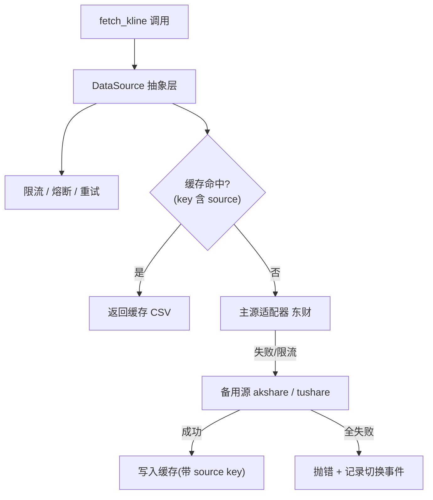

# Strategy Lab 多数据源接入（数据源抽象层）PRD

> 文档类型：简单 PRD（仅需求分析，不含实现代码）
> 负责人：产品经理 许清楚
> 阶段目标：先出架构方案供过目，本阶段不写实现代码
> 版本：v0.1（草案）

---

## 1. 项目信息

| 字段 | 内容 |
|------|------|
| Language | 简体中文 |
| Programming Language | Python 3.11+（平台既有栈，沿用 `STRATEGALAB_` 配置前缀，不引入前端框架） |
| Project Name | `multidatasource_layer` |
| 关联模块 | `src/strategylab/engine/data_feed.py`（`fetch_kline` 硬编码东财 `push2his`） |
| 配套 CLI | `strategylab`（既有入口 `strategylab.cli:main`） |
| 缓存目录 | `STRATEGALAB_DATA_DIR`（默认 `./data`，CSV 缓存存放处） |

### 原始需求复述
用户希望 Strategy Lab 行情数据获取模块支持多个数据源（除东方财富外，至少接入 akshare、tushare），**核心诉求是“避开公开 API 的 IP 限流”导致回测被卡住**。

现状痛点：当前 `fetch_kline` 直接硬编码调用东财 `push2his` K 线接口，限流、熔断、重试、本地 CSV 缓存逻辑全部与东财写法耦合，没有任何抽象层。生产环境跑全场预热时，因 8 并发打爆上游，触发东方财富 IP 限流（`RemoteDisconnected` 数千条失败）；加了全局限流 + 熔断后才勉强压到个位数失败，且仍需自愈等待。

经主理人澄清确认：
1. **核心诉求 = 避开限流**：用户最想解决的是公开 API 被 IP 限流卡住回测的问题。
2. **优先接入源（用户明确勾选）**：akshare（pip 直装开源聚合库，背后聚合东财/新浪/腾讯等多源，免费）；tushare（老牌接口，需注册 token，免费积分够用）。
3. **已排除项**：本地通达信 day 文件源——需本机安装通达信且有数据，用户本机未安装，暂不可用。
4. **探索项（现实约束）**：同花顺/券商源无稳定公开免费接口（iFind 付费、券商 App 行情多为私有加密协议，逆向有合规/稳定性风险），本次仅做接口预留。

---

## 2. 产品定义

### Product Goals（3 个正交目标）

| # | 目标 | 说明 |
|---|------|------|
| G1 | **解耦与抽象** | 建立统一 `DataSource` 抽象契约，将重试/限流/熔断/缓存等通用能力下沉到抽象层，使 `fetch_kline` 不再与单一数据源写法耦合，可插拔地接入任意数据源。 |
| G2 | **多源可用与容灾** | 在保留东财适配器的前提下接入 akshare、tushare，并支持主源失败自动切换到备用源，从根本上降低“单一公开源被 IP 限流卡住回测”的风险。 |
| G3 | **可配置与可观测** | 数据源可在全局/按品种维度通过配置（`.env` / 配置文件）选择，并提供 CLI 查看当前生效数据源、各源健康度与失败切换记录，便于排查与运维。 |

### User Stories（回测用户视角）

- **US-1**：As 回测用户，I want 配置多个数据源并指定主源/备用源，so that 当东财被 IP 限流时回测不会卡死、能自动从备用源取数。
- **US-2**：As 回测用户，I want 在 `.env` 或配置里一行切换数据源（如 `STRATEGALAB_DATA_SOURCE=akshare`），so that 我无需改代码即可换源排查问题。
- **US-3**：As 回测用户，I want 按品种单独指定数据源（如 `600216.SH` 走 tushare，其余走东财），so that 不同品种/板块能用最适合、最稳的源。
- **US-4**：As 回测用户，I want 命中复用的缓存能区分数据源，so that 东财和 tushare 对同一 `symbol` 的缓存不会互相混淆导致脏数据。
- **US-5**：As 回测用户/运维，I want 通过 CLI 查看当前生效数据源、各源健康度与失败切换记录，so that 出问题能快速定位是哪家源被限流或故障。

---

## 3. 技术规范

### Requirements Pool（优先级分层）

#### P0 — 必须有（Must have）

| ID | 需求 | 验收要点 |
|----|------|----------|
| P0-1 | **数据源抽象接口 `DataSource` 契约** | 定义统一方法，如 `fetch_kline(symbol, period, start, end, **params) -> KlineDataFrame`（入参/返回标准化）；抽象层统管**重试、限流、熔断、本地缓存策略**，与具体源解耦，适配器只实现取数逻辑。 |
| P0-2 | **东财适配器保留并解耦** | 将现有 `data_feed.py` 中硬编码的东财 `push2his` 逻辑封装为 `EastmoneyDataSource`，保持其既有行为（含限流/熔断）作为默认源，原有回测行为不回退。 |
| P0-3 | **配置化选择数据源（全局/按品种）** | 支持全局默认源：`.env` 的 `STRATEGALAB_DATA_SOURCE=eastmoney\|akshare\|tushare`；支持按品种覆盖：`STRATEGALAB_SYMBOL_SOURCE=600216.SH:tushare`（可多对，逗号分隔）。 |
| P0-4 | **命中复用缓存 key 区分数据源** | 缓存 key 由 `strategy_name+symbol+params_hash` 扩展为 `strategy_name + source + symbol + params_hash`，避免东财与 tushare 的 `600216.SH` 缓存混淆；缓存文件仍落 `STRATEGALAB_DATA_DIR`。 |

#### P1 — 应该有（Should have）

| ID | 需求 | 验收要点 |
|----|------|----------|
| P1-1 | **akshare 适配器** | 实现 `AkshareDataSource`，调用 akshare 聚合接口（需用户 pip 安装 akshare），兼容 `DataSource` 契约；缺失依赖时给出明确报错而非静默失败。 |
| P1-2 | **tushare 适配器** | 实现 `TushareDataSource`，调用 tushare（需用户注册 token 并配置 `STRATEGALAB_TUSHARE_TOKEN`），兼容 `DataSource` 契约。 |
| P1-3 | **自动容灾 / 故障转移** | 主源调用失败（限流/断连/超时）时，按 `STRATEGALAB_FALLBACK_SOURCES=akshare,tushare` 顺序自动切换备用源，并记录切换事件（源、时间、原因）。 |
| P1-4 | **CLI 查看当前数据源** | 提供 `strategylab datasource status` 命令，输出当前默认源、按品种覆盖、备用源顺序、各源健康度与最近切换记录。 |

#### P2 — 探索（Nice to have，标注现实约束）

| ID | 需求 | 现实约束 |
|----|------|----------|
| P2-1 | **同花顺/券商适配器接口预留** | 仅定义 `HexunBrokerDataSource` 之类**接口契约与配置项**，**不承诺可跑通**。原因：iFind 付费、券商 App 行情多为私有加密协议，逆向有合规/稳定性风险，需后续凭证或逆向评估才能落地。 |

---

### UI Design Draft（配置与查看方式）

本功能的“界面”主要是**配置（`.env`）与 CLI 查看**，非图形界面。示意如下：

#### A. `.env` 配置方式（对齐既有 `STRATEGALAB_` 前缀）

```bash
# 全局默认数据源（必填，默认 eastmoney）
STRATEGALAB_DATA_SOURCE=eastmoney          # 可选: eastmoney | akshare | tushare

# tushare 凭证（使用 tushare 时需注册并填写）
STRATEGALAB_TUSHARE_TOKEN=your_token_here

# 按品种覆盖（可选，逗号分隔多对）
# STRATEGALAB_SYMBOL_SOURCE=600216.SH:tushare,000001.SZ:akshare

# 容灾备用源顺序（可选，主源失败时的切换顺序）
# STRATEGALAB_FALLBACK_SOURCES=akshare,tushare

# 既有的缓存根目录（CSV 缓存落此处，key 已带 source 标识）
# STRATEGALAB_DATA_DIR=./data
```

> 备注：用户在原始提问中写的是 `DATA_SOURCE=...`，为贴合项目既有 `STRATEGALAB_` 配置风格（见 `.env.example`），本 PRD 建议统一改用 `STRATEGALAB_DATA_SOURCE=...`，避免 env 命名风格割裂。最终命名以架构设计为准。

#### B. CLI 查看当前数据源（`strategylab datasource status`）

```text
$ strategylab datasource status

当前默认数据源 : eastmoney
按品种覆盖     : 600216.SH -> tushare
备用源顺序     : [akshare, tushare]

东财(eastmoney): 健康度 正常 | 最近切换 无
akshare       : 健康度 正常 | 最近切换 无
tushare       : 健康度 正常 | 最近切换 无
```

#### C. 数据流示意（Mermaid，可选）



---

### Open Questions（待确认问题）

1. **切换策略**：主源失败时是采用**自动故障转移**（主源失败自动切备用源，P1-3）还是**仅配置静态源**（用户手动指定、不自动切换）？建议默认自动故障转移，且提供开关可关闭。
2. **缓存 key 是否带数据源标识**：多源并存时命中复用缓存 key 是否带数据源标识？建议带（已在 P0-4 默认采纳），待确认是否需处理历史旧缓存的迁移/失效。
3. **依赖安装责任**：tushare token / akshare 是否由用户自行 `pip install`？建议平台提供可选依赖组 `pip install strategylab[akshare,tushare]`，并在缺少依赖时给出明确报错，不强制打包进核心依赖。
4. **同花顺/券商源范围**：同花顺/券商源是否在本次仅做接口预留（P2）？建议是——只定义契约与配置项，不承诺可跑通，待后续凭证或逆向评估再决定是否落地。

---

## 4. 范围边界（明确排除）

- ❌ 本阶段不写任何实现代码，仅产出 PRD + 架构设计供过目。
- ❌ 不接入本地通达信 day 文件源（用户本机未安装通达信，数据不可用）。
- ❌ 不承诺同花顺/券商适配器可实际跑通（P2 仅接口预留）。
- ❌ 不引入前端/图形化配置界面（配置走 `.env`，查看走 CLI）。
