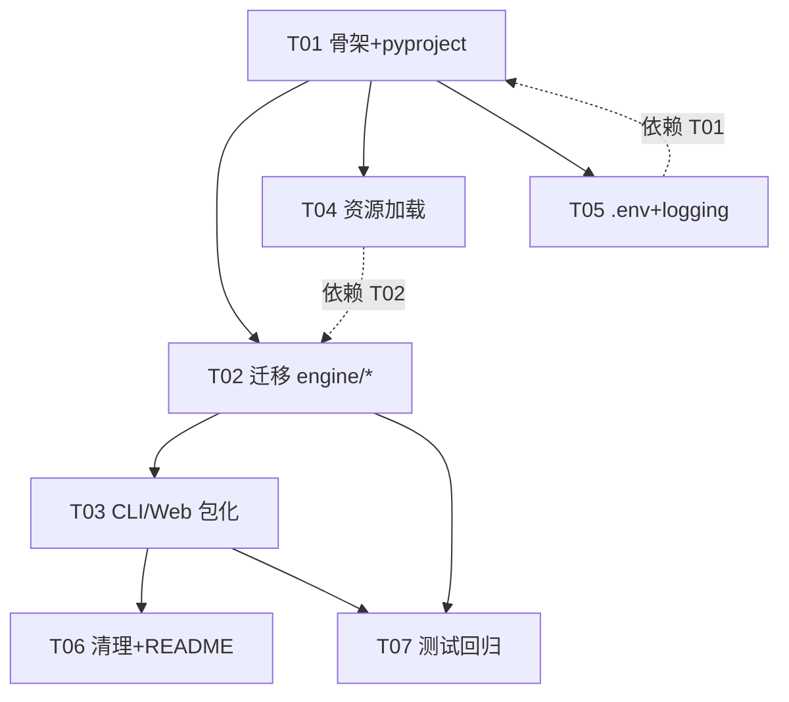

# Strategy Lab · src 布局迁移与包化重构 · 架构设计方案

> 作者：高见远（software-architect / Bob）
> 日期：2026-07-18
> 范围：把 `engine/` 裸包 + 根目录裸脚本（`run.py` / `web_app.py`）迁移到 PyPA 推荐的 `src/strategylab/` 布局，改用 `console_scripts` 入口点，清理验证残留垃圾文件，并解决资源路径（模板 / 策略 toml / 行情 CSV 缓存）在 src 布局下失效的问题。
> 目标读者：负责落地的 Engineer。本方案可直接照做，无需再回头确认引擎逻辑。

---

## 0. 设计原则与硬约束（落地时必须遵守）

| 约束 | 说明 |
|---|---|
| **引擎逻辑零改动** | `indicators.py`、`data_feed.py`、`search.py`、`engine/strategies/*`（策略代码 + 注册表）的**业务逻辑**不变，只搬位置 / 调 import。 |
| **DB 存储层保持不变** | `engine/storage/*` 的全部行为与对外 API（`save_run` / `get_run` / `list_runs` / `list_runs_by_ids` / `delete_run` / `db_row_to_result` / `init_db` / `get_session` / `get_engine` / `SessionLocal`）原样保留，只随包路径调整 import。 |
| **回归测试必须全过** | `tests/test_storage.py` 5 个测试（SQLite 内存库）迁移后必须仍通过。 |
| **DB 无关性保持** | `DATABASE_URL` 经环境变量控制，默认 `sqlite:///./strategy_lab.db`。 |
| **`.env` 自动加载** | 用 `python-dotenv` 在程序启动时 `load_dotenv()`，不再要求手动 `export DATABASE_URL`。 |
| **资源路径必须可解析** | `dashboard_template.html`、内置 `strategies/*.toml` 用 `importlib.resources` 读取；行情缓存 CSV 的基目录走 `get_data_dir()`（可配置）。 |

---

## 1. 目标目录树

```
strategy_lab/                          # 仓库根（保留项）
├── pyproject.toml                     # 【新增】替代裸脚本 + 收敛 requirements.txt
├── README.md                          # 【更新】命令改为 strategylab / strategylab-web / python -m strategylab
├── LICENSE                            # 【建议新增，待确认】开源包需要；建议 MIT
├── .env.example                       # 【更新】补充 STRATEGALAB_DATA_DIR / STRATEGALAB_STRATEGIES_DIR 示例
├── .gitignore                         # 【更新】/data、*.egg-info、_*.py/_*.out、nul 等规则
├── requirements.txt                   # 【可删】依赖已收敛进 pyproject；保留作参考亦可
├── src/
│   └── strategylab/
│       ├── __init__.py                # 公共 API 导出（run_symbol / list_runs / build_compare_from_runs / load_strategy / list_strategies ...）
│       ├── __main__.py                # `python -m strategylab` → 调用 cli.main()
│       ├── cli.py                     # 【原 run.py】删除 sys.path hack，改用包内 import
│       ├── web.py                     # 【原 web_app.py】同上
│       ├── settings.py                # load_dotenv() + get_data_dir() + get_strategies_dir()
│       ├── logging_config.py          # setup_logging() 统一日志
│       ├── engine/
│       │   ├── __init__.py            # re-export 常用 engine API（便于 `from strategylab.engine import run_symbol`）
│       │   ├── config.py              # load_strategy + 新增 load_strategy_by_arg / list_available_strategies
│       │   ├── backtest.py            # 逻辑不变，仅 import 调整
│       │   ├── dashboard.py           # 逻辑不变，仅 import 调整
│       │   ├── data_feed.py           # 逻辑不变（CSV 写到 get_data_dir() 传入的 out_dir）
│       │   ├── indicators.py          # 零改动
│       │   ├── search.py              # 零改动
│       │   ├── storage/               # 整个子包原样搬移，API 不变
│       │   │   ├── __init__.py        # 原样（get_engine/SessionLocal/init_db/get_session/模型/repository/serializers/migrate）
│       │   │   ├── db.py
│       │   │   ├── schema.py
│       │   │   ├── repository.py
│       │   │   ├── serializers.py
│       │   │   └── migrate.py
│       │   ├── strategies/            # 策略实现 + 注册表（零改动逻辑）
│       │   │   ├── __init__.py        # 原样（STRATEGY_REGISTRY / get_strategy_class / list_strategies）
│       │   │   ├── base.py
│       │   │   └── kdj_macd_dual_entry.py
│       │   └── vendor/                # 仪表盘渲染资源（vendor，可改 import/资源读取）
│       │       ├── __init__.py        # 空（保留）
│       │       ├── dashboard_template.html   # 用 importlib.resources 读取（随包走，安全）
│       │       ├── dashboard_locales.py
│       │       ├── export_results.py
│       │       └── render_dashboard.py        # 模板解析改为 importlib.resources.files(...)
│       └── resources/
│           └── strategies/
│               └── kdj_macd_dual_entry.toml   # 【内置默认策略】importlib.resources 读取
├── tests/
│   ├── test_storage.py               # 【改】import 改为 strategylab.engine.storage；sys.path 指向 src/
│   └── conftest.py                   # 【新增，可选】把 src/ 加入 sys.path（便于不装包也能跑测试）
├── docs/                             # 保留原有（需求文档/技术文档/system_design.md/数据库存储改造-交付报告...）；本文档为新增
└── data/                             # 【运行时生成】行情缓存 CSV（*_daily.csv / *_weekly.csv），gitignored
```

> 注：根目录遗留的 `002xxx_sz_daily.csv`、`index.html`、各 `*.csv` 已被 `.gitignore` 覆盖，属用户缓存，可保留（迁移后新缓存会写到 `./data/`）；T06 仅强制删除明确列出的“验证残留垃圾文件”。

---

## 2. `pyproject.toml` 草图（采用 setuptools，src layout）

```toml
[build-system]
requires = ["setuptools>=68", "wheel"]
build-backend = "setuptools.build_meta"

[project]
name = "strategylab"
version = "0.2.0"
description = "A股周线MACD+日线KDJ双入口做T量化回测服务（结果落库，DB无关）"
readme = "README.md"
requires-python = ">=3.11"          # tomllib 需 3.11+；如要兼容 3.10 需额外依赖 tomli
license = { text = "MIT" }          # 待确认；与 LICENSE 文件一致
dependencies = [
    "sqlalchemy>=2.0",
    "pymysql>=1.1",                  # 正式库为 MySQL，作为硬依赖
    "pandas",
    "numpy",
    "python-dotenv",                 # .env 自动加载
]

[project.optional-dependencies]
dev = ["ruff", "black", "mypy", "pytest", "pytest-cov"]
postgres = ["psycopg2-binary>=2.9"]  # 仅用 PostgreSQL 时安装

[project.scripts]
strategylab = "strategylab.cli:main"
strategylab-web = "strategylab.web:main"

[tool.setuptools.packages.find]
where = ["src"]

[tool.setuptools.package-data]
"strategylab.resources" = ["**/*"]
"strategylab.engine.vendor" = ["*.html"]

[tool.ruff]
line-length = 100
target-version = "py311"

[tool.ruff.lint]
select = ["E", "F", "I", "UP", "B"]   # 默认不过度严格；不强制复杂规则

[tool.black]
line-length = 100

[tool.mypy]
python_version = "3.11"
ignore_missing_imports = true

[tool.pytest.ini_options]
testpaths = ["tests"]
addopts = "-q --cov=strategylab --cov-report=term-missing"
```

要点：
- `where = ["src"]` 让 setuptools 只打包 `src/strategylab`。
- `package-data` 保证 `resources/**` 与 `vendor/*.html` 进 wheel（`importlib.resources` 才能读到）。
- 依赖从 `requirements.txt` 收敛：`psycopg2-binary` 降为可选 `postgres` 组（默认 DB 是 MySQL，pymysql 保留为硬依赖）。
- `requires-python = ">=3.11"`（代码已用 `tomllib`、PEP 604 等）。

---

## 3. 旧路径 → 新路径映射表

| 旧路径（仓库根 / `engine/`） | 新路径 | 改动类型 |
|---|---|---|
| `run.py` | `src/strategylab/cli.py` | 删 `HERE`/`sys.path.insert`，import 改包内；逻辑保留 |
| `web_app.py` | `src/strategylab/web.py` | 同上 |
| `engine/__init__.py`（空） | `src/strategylab/engine/__init__.py` | 保留空或加 re-export |
| `engine/config.py` | `src/strategylab/engine/config.py` | 保留 `load_strategy`；**新增** `load_strategy_by_arg` / `list_available_strategies` |
| `engine/backtest.py` | `src/strategylab/engine/backtest.py` | 仅 import 调整（`.data_feed`→`.data_feed` 不变；包内相对 import 仍可用） |
| `engine/dashboard.py` | `src/strategylab/engine/dashboard.py` | 仅 import 调整 |
| `engine/data_feed.py` | `src/strategylab/engine/data_feed.py` | **逻辑零改**；CSV 写到调用方传入的 `out_dir`（= `get_data_dir()`） |
| `engine/indicators.py` | `src/strategylab/engine/indicators.py` | 零改 |
| `engine/search.py` | `src/strategylab/engine/search.py` | 零改 |
| `engine/storage/__init__.py` | `src/strategylab/engine/storage/__init__.py` | 原样 |
| `engine/storage/{db,schema,repository,serializers,migrate}.py` | `src/strategylab/engine/storage/*` | API 原样，仅包路径 |
| `engine/strategies/__init__.py` | `src/strategylab/engine/strategies/__init__.py` | 原样（注册表） |
| `engine/strategies/base.py` | `src/strategylab/engine/strategies/base.py` | 零改 |
| `engine/strategies/kdj_macd_dual_entry.py` | `src/strategylab/engine/strategies/kdj_macd_dual_entry.py` | 零改（`from ..indicators import ...` 相对 import 仍有效） |
| `engine/vendor/__init__.py` | `src/strategylab/engine/vendor/__init__.py` | 空，保留 |
| `engine/vendor/dashboard_template.html` | `src/strategylab/engine/vendor/dashboard_template.html` | 读取改 `importlib.resources` |
| `engine/vendor/dashboard_locales.py` | `src/strategylab/engine/vendor/dashboard_locales.py` | 零改 |
| `engine/vendor/export_results.py` | `src/strategylab/engine/vendor/export_results.py` | 零改 |
| `engine/vendor/render_dashboard.py` | `src/strategylab/engine/vendor/render_dashboard.py` | 模板解析改 `importlib.resources.files(...)` |
| `strategies/kdj_macd_dual_entry.toml` | `src/strategylab/resources/strategies/kdj_macd_dual_entry.toml` | 作为内置资源；用户自定义策略走 `--strategy <路径>` 或 `STRATEGALAB_STRATEGIES_DIR` |
| `tests/test_storage.py` | `tests/test_storage.py` | 改 import 路径 + sys.path 指向 `src/` |
| `requirements.txt` | （保留或删除） | 依赖已入 pyproject |
| `README.md` | `README.md` | 命令说明更新 |
| `.env.example` / `.gitignore` | 同路径 | 内容更新 |

---

## 4. 包公共 API 设计

### 4.1 `src/strategylab/__init__.py`（公共 API 主入口）

```python
# -*- coding: utf-8 -*-
"""Strategy Lab 公共 API。import 本包即自动加载 .env 并初始化日志。"""
from __future__ import annotations

from .settings import load_dotenv as _load_dotenv  # 触发 .env 加载
from .logging_config import setup_logging

_load_dotenv()
setup_logging()

from .engine.backtest import run_symbol
from .engine.dashboard import build_compare_dashboard, build_compare_from_runs
from .engine.config import load_strategy, load_strategy_by_arg, list_available_strategies
from .engine.strategies import list_strategies, get_strategy_class
from .engine.search import search_a_stocks
from .engine.storage import init_db, get_engine, SessionLocal, get_session
from .engine.storage.repository import (
    save_run, get_run, list_runs, list_runs_by_ids, delete_run,
)

__all__ = [
    "run_symbol",
    "build_compare_dashboard",
    "build_compare_from_runs",
    "load_strategy",
    "load_strategy_by_arg",
    "list_available_strategies",
    "list_strategies",
    "get_strategy_class",
    "search_a_stocks",
    "init_db",
    "get_engine",
    "SessionLocal",
    "get_session",
    "save_run",
    "get_run",
    "list_runs",
    "list_runs_by_ids",
    "delete_run",
]
```

> `engine/__init__.py` 也建议 re-export 上述常用项，便于 `from strategylab.engine import run_symbol`；但**真正的公共契约在 `strategylab` 顶层**。

### 4.2 `src/strategylab/__main__.py`（`python -m strategylab`）

```python
# -*- coding: utf-8 -*-
"""支持 `python -m strategylab`，等价于 console_scripts `strategylab`。"""
from __future__ import annotations

from .cli import main

if __name__ == "__main__":
    main()
```

默认行为：**运行 CLI**（`main()`）。因 `main()` 使用 `argparse` 且 `--symbols/--start/--end` 为必填，不带参数时会打印 usage 并退出（等同于“打印帮助”）。如需更友好的 `--help` 默认，可在 `cli.main()` 里判断 `len(sys.argv) == 1` 时自动 `ap.print_help()`。

---

## 5. 资源加载方案

### 5.1 仪表盘模板 `dashboard_template.html`

当前 `render_dashboard.py` 用 `Path(__file__).with_name("dashboard_template.html")`——本质是模块绝对路径，迁移后仍可用。但按“资源用 importlib.resources”要求，改为：

```python
# 在 render_dashboard.py 中
from importlib import resources

def _load_template(template_path=None):
    if template_path:
        return Path(template_path).read_text(encoding="utf-8")
    return resources.files("strategylab.engine.vendor") \
               .joinpath("dashboard_template.html").read_text(encoding="utf-8")
```

文件保留在 `src/strategylab/engine/vendor/dashboard_template.html`（随包走，`package-data` 已声明）。

### 5.2 内置策略 `kdj_macd_dual_entry.toml`

- 放入 `src/strategylab/resources/strategies/kdj_macd_dual_entry.toml`（随包 resource）。
- `engine/config.py` 新增 `load_strategy_by_arg(arg)`：
  1. `arg` 是已存在的文件路径 → 调现有 `load_strategy(path)`；
  2. 否则当作别名，先查 `STRATEGALAB_STRATEGIES_DIR` 环境变量目录下的 `<alias>.toml/.json`；
  3. 再查包内置资源 `strategylab.resources.strategies` 下的 `<alias>.toml/.json`（用 `importlib.resources.files(...).read_text()`）；
  4. 都没有 → `FileNotFoundError`。
- Web 的策略下拉 `list_strategy_options()` 改为调用新增 `list_available_strategies() -> list[(name, alias)]`，扫描“内置资源 + 用户目录”。

### 5.3 行情缓存 CSV 基目录

- 新增 `settings.get_data_dir() -> Path`：读 `STRATEGALAB_DATA_DIR`，默认 `./data`，自动 `mkdir(parents=True, exist_ok=True)`。
- CLI：`--out` 缺省时 `out_dir = get_data_dir()`（`index.html` 与 CSV 缓存都写这里）。
- Web：固定 `out_dir = get_data_dir()`（原 `HERE` 改为 data_dir）。
- `data_feed.ensure_data(sym_cfg, out_dir, ...)` 逻辑**不改**，只是调用方传入的 `out_dir` 变了。

---

## 6. logging 方案

- 新增 `src/strategylab/logging_config.py`：

```python
# -*- coding: utf-8 -*-
import logging
import os

def setup_logging() -> None:
    if logging.getLogger().handlers:   # 幂等，避免重复添加 handler
        return
    level = os.environ.get("STRATEGALAB_LOG_LEVEL", "INFO").upper()
    logging.basicConfig(
        level=getattr(logging, level, logging.INFO),
        format="%(asctime)s [%(levelname)s] %(name)s: %(message)s",
    )
```

- 每个模块统一 `logger = logging.getLogger(__name__)`。
- `cli.py` / `web.py` 里的 `print(...)` 改为 `logger.info(...)` / `logger.warning(...)`（入口层不在“零改动”清单内，允许改）。
- 包导入时（`strategylab/__init__.py`）即调用 `setup_logging()`，保证任何入口都先配好日志。
- `data_feed.py` 内两处 `print`（缓存复用 / 取数条数）受“引擎逻辑零改动”保护，默认**保留**；如希望统一日志风格，需用户明确放宽该约束（见 §9 风险项 5）。

---

## 7. 任务分解列表（T01..T07，有序 + 依赖）

> 说明：团队任务书中已明确给出 T01..T07 框架，本方案沿用 7 个任务（而非通用 ≤5 上限），并按“引擎逻辑零改动”重排依赖。

| 任务 | 名称 | 依赖 | 优先级 | 内容要点 |
|---|---|---|---|---|
| **T01** | 项目骨架 + `pyproject.toml` | — | P0 | 建 `src/strategylab/` 目录树；写 `pyproject.toml`（见 §2）；建空 `__init__.py`（各包）；写 `settings.py`（`load_dotenv`+`get_data_dir`+`get_strategies_dir`）、`logging_config.py`（`setup_logging`）；建 `resources/strategies/` 并放入默认 `kdj_macd_dual_entry.toml`；放好 `engine/vendor/dashboard_template.html`。**暂不搬引擎代码**。 |
| **T02** | 迁移 `engine/*` 全部模块 | T01 | P0 | 把 `engine/{config,backtest,dashboard,data_feed,indicators,search}.py`、`engine/storage/*`、`engine/strategies/*`、`engine/vendor/*` 搬到 `src/strategylab/engine/`，修正包内 import（相对 import 基本不变；跨子包用 `strategylab.engine...` 或相对 `..`）。storage API 与策略注册表**原样**。写 `engine/__init__.py` re-export。 |
| **T03** | CLI / Web 入口包化 | T02 | P0 | `run.py→cli.py`、`web_app.py→web.py`：删 `HERE`/`sys.path.insert`，改用包内 import（`from .engine...`、`from .settings import get_data_dir`、`from .logging_config import setup_logging`）。写根 `__init__.py` 公共 API（§4.1）、`__main__.py`（§4.2）。`console_scripts` 在 pyproject 已声明。 |
| **T04** | 资源加载改造 | T01, T02 | P0 | `render_dashboard.py` 模板解析改 `importlib.resources`；`engine/config.py` 新增 `load_strategy_by_arg` / `list_available_strategies`；CLI/Web 的 `_resolve_strategy` 改用它们；CLI/Web 的 `out_dir` 改用 `get_data_dir()`。 |
| **T05** | `.env` 自动加载 + logging 替换 print | T01 | P1 | `settings.py` 模块级 `load_dotenv()`（T01 已含，本任务校验生效）；根 `__init__.py` 调 `setup_logging()`；`cli.py`/`web.py` 的 `print` 改 `logger`。 |
| **T06** | 清理垃圾文件 + `.gitignore` + README | T03 | P1 | 删除：`_csv_range.py`/`_csv_range.out`/`_mysql_check.py`/`_mysql_check.out`/`_mysql_run1.out`/`_mysql_run2.out`/`_mysql_verify.py`/`_mysql_verify.out`/`nul`/`compare_mysql.html`/`mysql_compare.html`/`strategy_lab.db`。更新 `.gitignore`（新增 `/data/`、`*.egg-info/`、`_*.py`、`_*.out`、`nul` 等）。重写 README 命令段（`strategylab` / `strategylab-web` / `python -m strategylab` / `STRATEGALAB_DATA_DIR`）。 |
| **T07** | 测试结构与回归 | T02, T03 | P0 | 更新 `tests/test_storage.py`：`sys.path.insert(0, src_dir)`，`from strategylab.engine.storage import db, repository`；确保 5 测试仍过。可选新增 `tests/conftest.py`（加 `src/` 到 path）、`tests/test_cli_smoke.py` / `tests/test_web_smoke.py` 冒烟（mock 取数）。 |

依赖关系图（Mermaid）：



---

## 8. 共享约定（跨文件）

1. **包导入风格**：包内统一用绝对导入 `from strategylab.engine.xxx import yyy`；子包内部（如 `engine/strategies/`）可用相对 `from .base import BaseStrategy`、`from ..indicators import ...`。入口 `cli.py`/`web.py` 用 `from .engine...`。
2. **类型注解**：每个 `.py` 顶部保留 `from __future__ import annotations`（与现有代码一致），允许 PEP 604 `X | None` 写法。
3. **日志**：统一 `logger = logging.getLogger(__name__)`；不使用 `print`（入口层在 T05 改造，引擎层默认保留见 §6）。
4. **资源读取 helper**：统一放 `settings.py`（`get_data_dir` / `get_strategies_dir`）与 `engine/config.py`（`load_strategy_by_arg` / `list_available_strategies` / 内置资源读取）；模板读取在 `render_dashboard.py` 内用 `importlib.resources`。
5. **`.env` 加载**：集中在 `settings.py` 模块级 `load_dotenv()`，包导入即生效；任何读 `DATABASE_URL` 的调用（懒加载）都在其之后。
6. **DB 单例**：继续用 `engine/storage/db.py` 的 `get_engine()` 懒加载单例；不引入新的连接管理方式。
7. **编码头**：每个文件保留 `# -*- coding: utf-8 -*-`（与现有一致）。

---

## 9. 待确认 / 风险项

| # | 事项 | 我的建议 | 影响 |
|---|---|---|---|
| 1 | 策略 toml 放包内 `resources/` 还是仓库根 `strategies/`？ | **内置放 `resources/`（importlib.resources 读）；用户自定义走 `--strategy <路径>` 或 `STRATEGALAB_STRATEGIES_DIR`**。兼顾“可打包分发”与“不改包即可加策略”。 | 决定 §3/§5.2 落地形态 |
| 2 | 行情缓存 `data/` 默认位置 | 默认 `./data`（env `STRATEGALAB_DATA_DIR` 可改）。 | 影响 CSV 落点 |
| 3 | 是否需要 `LICENSE` | 建议新增 `MIT`（开源包惯例），与 `pyproject` 的 `license` 字段一致。 | 待用户拍板 |
| 4 | `ruff` 严格度 | 默认 `select = ["E","F","I","UP","B"]`，`line-length=100`，不过度严格。 | 代码风格 |
| 5 | `data_feed.py` 的 `print` 是否改 logger | 受“引擎逻辑零改动”保护，**默认保留**；如需统一日志，请明确放宽该文件约束。 | 日志一致性 |
| 6 | Python 版本 | `requires-python = ">=3.11"`（已用 `tomllib`）。若需 3.10，要加 `tomli` 依赖。 | 运行环境 |
| 7 | `tests/test_storage.py` 如何 import 包 | 方案 A：`pip install -e .` 后 `import strategylab.engine.storage`（推荐）；方案 B：测试里 `sys.path.insert(0, src_dir)`（不装包也能跑，T07 采用）。 | 测试可达性 |
| 8 | Web 的 `index.html` / 临时对比 HTML 写出位置 | 统一写到 `get_data_dir()`（原 `HERE`）。`/compare` 的临时文件仍用 `tempfile`，不影响。 | 磁盘落点 |
| 9 | `requirements.txt` 是否删除 | 依赖已入 `pyproject`；建议删除避免两份来源不一致（或保留并注明“已废弃”）。 | 文档一致性 |

---

## 附：关键调用流（Mermaid，详见 `docs/src-layout-sequence.mermaid`）

- **CLI 跑回测**（`strategylab --symbols X --start --end` 或 `python -m strategylab ...`）：设置 → 解析策略 → `run_symbol`（取数→策略→`export_results(write_files=False)`→`save_run` 落库）→ `build_compare_dashboard` 写 `index.html`。
- **Web 跑回测**（`strategylab-web`）：HTTP 表单 → `run_backtest`（同引擎）→ 注入返回按钮。
- **跨回测对比**（`/compare` 或未来 CLI）：`build_compare_from_runs(run_ids)` → `render_dashboard`（模板走 importlib.resources）→ 返回自包含 HTML。

## 附：包结构关系（Mermaid，详见 `docs/src-layout-class.mermaid`）

以模块为节点，标注公共 API 与 `«import»` / 资源依赖。
