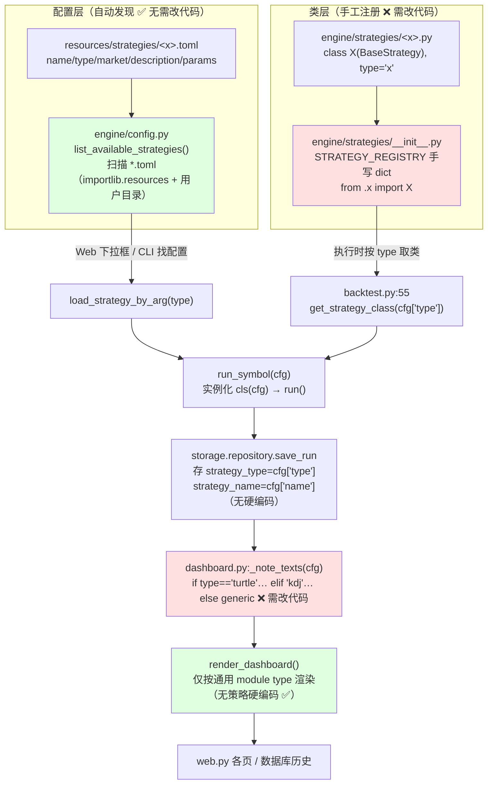

# Strategy Lab ·「多交易策略维护」架构评审报告

> 评审人：架构师（高见远）
> 评审性质：**只读代码 + 分析**，未修改任何代码
> 目标：评估「每加一个策略要改很多文件」是否属实、问题根因、优化方案与可分步落地的迁移路线
> 已读代码（均亲自核对，非仅凭口述）：
> - `src/strategylab/engine/strategies/__init__.py`（注册表）
> - `src/strategylab/engine/strategies/base.py`、`turtle.py`、`kdj_macd_dual_entry.py`
> - `src/strategylab/resources/strategies/turtle.toml`、`kdj_macd_dual_entry.toml`
> - `src/strategylab/engine/backtest.py`、`engine/config.py`、`engine/dashboard.py`
> - `src/strategylab/web.py`、`engine/vendor/render_dashboard.py`、`cli.py`

---

## 0. 一句话结论

用户的感觉**基本属实，但被夸大了范围**。当前结构在「新增策略」这一核心扩展轴上的确繁琐，根因只有 **2 个手工改动点 + 1 个双发现源不一致**，而不是"到处都要改"：

- 加一个策略 **必须** 动的：① 新 `.py` 类 + ② 新 `.toml` 配置（这两个无法避免，因为新算法必然要写代码）+ ③ 手工改 `strategies/__init__.py` 注册 + ④ 手工改 `dashboard.py` 加文案分支。
- 展示层（web.py / render_dashboard.py）**没有**按策略 `type` 的硬编码——团队 lead 假设的"前端还有其它硬编码分支"在本仓库**不成立**，唯一的展示层硬编码就是 `dashboard.py:_note_texts`。
- 更隐蔽的隐患：**配置发现是自动的、类注册是手工的**，两者是两套独立的"真相源"，会制造"UI 能选但执行报错"的坑。

---

## 1. 当前策略全生命周期与「改动点」地图

### 1.1 生命周期（注册 → 发现 → 配置 → 执行 → 存储 → 展示）

### 1.2 全链路改动点表（加新策略时每处是否需要改）

| 阶段 | 文件 : 行 | 当前机制 | 加新策略「X」时是否需改动 | 改动性质 |
|---|---|---|---|---|
| 配置 | `resources/strategies/x.toml` | 新文件 | **是（新增文件）** | 不可避免（新参数/说明） |
| 类实现 | `engine/strategies/x.py` | 新文件，`type="x"` | **是（新增文件）** | 不可避免（新算法） |
| 类注册 | `engine/strategies/__init__.py:6-12` | 手写 `from .x import X` + 加入 dict | **是（编辑现有文件）** ❌ | 手工注册，违反 OCP |
| 取类执行 | `engine/backtest.py:55` | `get_strategy_class(cfg["type"])` | **否**（行本身不动，依赖上方注册表） | 消费方，无需改 |
| 配置发现 | `engine/config.py:85-139` | 扫描 `*.toml` | **否（自动）** ✅ | 零改动 |
| Web 下拉 | `web.py:70-72,121-123,527-529,779-781` | 调 `list_available_strategies()` | **否（自动）** ✅ | 零改动 |
| 存储 | `backtest.py:88-102` / `storage/repository.py` | 存 `type`/`name` 字符串 | **否** | 通用，无硬编码 |
| 渲染器 | `engine/vendor/render_dashboard.py` | 仅按 module type 渲染 | **否（无策略硬编码）** ✅ | 零改动 |
| 展示文案 | `engine/dashboard.py:22-141` | `_note_texts` 里 `if/elif` + `_note_texts_x` 函数 | **是（编辑现有文件）** ❌ | 硬编码分发，违反 OCP/SRP |

### 1.3 关键发现（超出原始假设，请重点关注）

**(a) 双发现源不一致 —— 最隐蔽的坑**
- Web UI 的策略下拉由 `config.py:list_available_strategies()` 扫描 `*.toml` 自动生成（**只认 toml**）。
- CLI `strategylab --list-strategies`（`cli.py:92-95`）和**执行链路**（`backtest.py:55`）用的是 `engine/strategies/__init__.py` 的 `STRATEGY_REGISTRY`（**只认手工注册的类**）。
- 后果：若用户「复制一份 toml 改参数」但**忘记在 `__init__.py` 注册对应类**，UI 会把这个策略列出来、能选、能提交，但执行时 `get_strategy_class` 抛 `KeyError`（backtest.py:55）。这正是 README 宣称"复制本文件改 params 即可、运行时不改任何代码"与现实的落差来源。

**(b) 展示层硬编码只在 `dashboard.py` 一处**
- 团队 lead 假设"前端/展示层可能还有其它按 type 的硬编码"。实测：`web.py` 全部走 `list_strategy_options()`（toml 扫描）+ 通用渲染；`render_dashboard.py` 只判断 `module["type"]`（如 `position_table`/`overview_chart`，是渲染模块类型，非策略类型）。**除 `dashboard.py:_note_texts` 外，无任何按策略 `type` 的 if/elif。**

**(c) 已有 `description` 字段是天然的元数据落脚点**
- 两个 toml 都有 `description`，且 `_note_texts_generic` 已经在用它兜底。说明"文案进配置/进类"已有地基，迁移成本低。

**(d) `name` 子串兜底属于脆弱隐式路由**
- `dashboard.py:47` `if strategy_type == "turtle" or "海龟" in strategy_name:`——靠策略名里含"海龟"二字来兜底路由，换名字就会错配。方案 C（按类查询）可彻底删除它。

### 1.4 「加一个策略」的改动成本清单（量化）

**现状（加一个全新算法策略 X）：**
- 新增文件：**2 个**（`x.py` + `x.toml`）
- 编辑现有文件：**2 个**（`strategies/__init__.py`、`dashboard.py`）
- 新增硬编码分支：**≥2 处**（`__init__.py` 字典项 1 处 + `dashboard.py` 的 `elif` 分支 1 处 + 新函数 `_note_texts_x` 1 个）
- 隐性风险点：**1 处**（漏注册 → 运行时 KeyError）

**若只是「同算法 + 新参数/新说明」的变体（理论上最该"零代码"的场景）：**
- 现状仍要改 `dashboard.py`（除非复用 generic 文案，但那就丢失专属说明）—— 所以连"加变体"都不够顺滑。

---

## 2. 结构是否过度 / 繁琐？——基于 PRD 目标「维护多个交易策略」的判断

目标拆解：**"能低成本地维护（新增/改参/停用）多个策略"**。据此评估：

| 原则 | 现状 | 判定 |
|---|---|---|
| 开放封闭 OCP | `STRATEGY_REGISTRY` 每加策略要**改 `__init__.py`**；`dashboard._note_texts` 每加策略要**改 `dashboard.py`**。两处都是"为扩展而修改"。 | **违反**（扩展轴 = 新增策略） |
| 单一职责 SRP | `dashboard.py` 本应只负责"把策略自述渲染出来"，却耦合了 turtle/kdj 的具体文案生成逻辑。 | **部分违反** |
| 不要重复（DRY） | `_note_texts_turtle` 重新读 `params.get("turtle")`，与 `turtle.py` 读同一份参数结构；且 registry 与 toml 两处都表达"有哪些策略"。 | **部分违反** |
| 整体是否过度设计 | 分层（config / strategy / backtest / storage / dashboard / web）清晰，storage 抽象、vendor 渲染器都是合理设计；问题**只集中在 2 个手工点 + 1 个双源**，并非整体臃肿。 | **不算过度**，局部繁琐 |

**结论**：对"多策略维护"这个目标，当前结构在**新增策略**维度确实繁琐，但属于**局部可修复**的繁琐，不是架构级灾难。最该修的是把"扩展动作"从"改中心文件"变成"扔一个文件就被发现"。

---

## 3. 优化方案（由浅入深，含对比权衡）

### 方案 A：自动发现（Convention over Configuration）
- **做法**：删除 `strategies/__init__.py` 里的手写 dict，改为 `discover_strategies()` 在 import 时扫描 `engine/strategies/*.py`，收集 `BaseStrategy` 的子类（排除 `base.py`、排除抽象/未设 `type` 者），以 `cls.type` 为键建表。`get_strategy_class` / `list_strategies` API 保持不变。
- **消除的改动点**：`__init__.py` 的手工注册（第 ③ 点）。
- **实现成本**：低（约 30–40 行扫描 + 碰撞检测）。
- **风险**：低。现有 turtle/kdj 已设 `type`，自动发现后行为完全一致；需处理 import 顺序与"基类/抽象类排除"。
- **兼容**：turtle/kdj 继续可用，仅注册方式从手写变扫描，对外 API 不变。

### 方案 B：配置 / 元数据驱动展示
- **做法**：把 `_note_texts_turtle` / `_note_texts_kdj` 的文案搬到**元数据**：
  - (b1) toml 里加结构化 `notes`（如 `[notes]` 多行 / `summary_points = [...]`）；或
  - (b2) 在策略类上加 `describe(params) -> str` 方法。
  - 然后 `_note_texts(cfg)` 变为：`cls = get_strategy_class(type); note = cls.describe(params) if hasattr(cls,'describe') else _note_texts_generic(cfg, params)`。删除 `if/elif` 与两个专用函数。
- **消除的改动点**：`dashboard.py` 的 `if/elif` + 专用函数（第 ④ 点）。
- **实现成本**：低（`description` 已存在，b1 几乎零代码；b2 把现有 f-string 挪到类方法）。
- **风险**：低。建议优先 **b1（toml 驱动）**：因为 toml 已是自动发现，文案进 toml = 连 `.py` 都不用为"说明"动。
- **兼容**：turtle/kdj 文案逐字保留（同 f-string），generic 兜底仍在。

### 方案 C：策略自描述接口（★推荐评估）
- **做法**：在 `BaseStrategy` 上定义**可选契约**：
  - `describe(params) -> str`：返回「实现要点」文案；
  - （可选）`render_hints() -> dict`：返回图表/字段提示。
  - `dashboard` 只依赖接口，绝不出现 `type` 字符串分发。
  - **叠加 A + B**：自动发现类 + 类/配置自描述。终态 = "加策略 = 写一个类 + 一份配置，零分发代码"。
- **消除的改动点**：③ + ④ 一起消除；并删掉 `name` 子串兜底。
- **实现成本**：中（改 `BaseStrategy` 契约 + 两个策略类补 `describe` + `dashboard` 改读接口）。
- **风险**：中（需回归 turtle/kdj 两个策略确认文案/行为不变；契约演进需文档）。
- **兼容**：存量策略通过"补 `describe` 或复用 generic"平滑过渡；不改对外 API。

### 过渡方案（最轻量、见效最快）：registry 映射 `type → (class, note_fn)`
- **做法**：保留 `STRATEGY_REGISTRY`，但值改成 `(class, note_fn)` 或把 `note_fn` 作为类方法；`_note_texts` 改为 `get_note_fn(type)` 查表，不再 `if/elif`。新增策略在 `__init__.py` 一并登记类与文案函数。
- **消除的改动点**：仅 `dashboard.py` 的 if/elif（分发逻辑挪到注册处，和类放一起）。
- **实现成本**：极低；**风险**：极低。
- **局限**：**仍要改 `__init__.py`**（OCP 未彻底解决），但能把"展示分发"从 dashboard 解耦，是迈向 C 的垫脚石。

---

## 4. 方案对比表

| 方案 | 消除的改动点 | 实现成本 | 风险 | 推荐度 | 备注 |
|---|---|---|---|---|---|
| **A 自动发现** | `__init__.py` 手工 dict（1 处文件编辑） | 低（~40 行） | 低 | ★★★★ | 先做，收益高、风险低 |
| **B 元数据驱动展示** | `dashboard.py` if/elif + 专用函数（1 处文件编辑 + 1 分支） | 低（`description` 已有） | 低 | ★★★★ | 建议走 toml 驱动 |
| **C 策略自描述接口** | ③+④ 全消除，零分发代码 | 中 | 中 | ★★★★★ | 最终目标，= A+B |
| **过渡：registry 映射** | 仅 dashboard 的 if/elif | 极低 | 极低 | ★★★ | 快速见效，但①仍在 |

> 推荐落地顺序：**过渡方案（或直上 B）→ A → C**。其中 A 与 B 可并行、互不依赖；C 是两者合流。

---

## 5. 关键收益与风险（以推荐方案 C 为基准）

**收益**
- 加新策略从「2 新文件 + 2 改文件 + ≥2 硬编码分支」降为「2 新文件、0 改文件、0 硬编码分支」。
- 消除双发现源不一致：toml 与类都被"自动 + 契约"统一管理，杜绝"UI 能选却执行 KeyError"。
- 符合 OCP/SRP：dashboard 对扩展封闭（不再改），扩展靠新类/新配置开放。
- 文案与算法同属一个策略，改参数时不会忘记同步说明（DRY）。

**风险 / 缓解**
- 自动发现需小心 import 副作用与 `type` 冲突 → 加明确的冲突报错 + 排除 `base.py`。
- 改 `BaseStrategy` 契约 → 用小步迁移，存量 turtle/kdj 先补 `describe` 再清理 dashboard 分支。
- 线上已运行（PID 41088，改动仅重启生效）→ 每步都是"重启即生效、可回滚"的纯重构，无数据迁移。

---

## 6. 增量迁移路线（分步落地、每步向后兼容、可独立提测）

> 全程不改对外 API、不改 `type` 取值（"turtle" / "kdj_macd_dual_entry" 不变）、不改存储结构。每步结束都能独立回归 turtle + kdj。

### 里程碑 M1 — 展示层去硬编码（对应方案 B / 过渡方案）
- **目标**：`dashboard.py` 不再出现 turtle/kdj 的 if/elif，文案改由策略类/`describe` 提供。
- **改动文件**：`engine/strategies/turtle.py`、`kdj_macd_dual_entry.py`（加 `describe(params)` 方法，内容=现有 f-string 原样搬入）；`engine/dashboard.py`（`_note_texts` 改为查 `cls.describe` 或 generic；删除 `if/elif` 与 `_note_texts_turtle/_kdj` 两个函数；删除 `name` 子串兜底）。
- **行为保持**：turtle/kdj 仪表盘「策略实现要点」文案逐字不变（同字符串）。
- **提测**：对 turtle、kdj 各跑一次单标的 + 对比 + 跨回测对比，diff 仪表盘中「策略实现要点/已知局限/免责」文本与改造前一致。
- **回滚**：改回 `dashboard.py` 即可。

### 里程碑 M2 — 类注册自动发现（对应方案 A）
- **目标**：删除 `STRATEGY_REGISTRY` 手写 dict，改为扫描 `engine/strategies/*.py` 收集 `BaseStrategy` 子类。
- **改动文件**：`engine/strategies/__init__.py`（用 `discover_strategies()` 替换手写 dict；保留 `get_strategy_class` / `list_strategies` 签名）。
- **行为保持**：turtle/kdj 仍能被 `get_strategy_class` 解析、`--list-strategies` 仍列出二者。
- **提测**：CLI `--list-strategies` 输出含 turtle/kdj；Web 跑回测执行成功；故意制造 `type` 重复 → 启动报清晰错误。
- **回滚**：恢复手写 dict。

### 里程碑 M3 —（可选）配置元数据驱动描述，支持"纯配置变体"
- **目标**：把 `describe` 内容或 richer `notes` 搬进 toml，使"同算法 + 新参数/新说明"的变体**只需新增一个 toml**（复用现有类，不必新建 `.py`）。
- **改动文件**：toml 加 `notes` 段；`describe` 默认读 toml `notes`（类方法可覆盖）。
- **价值**：仅当存在"大量同算法变体"需求时才显著；全新算法仍要写 `.py`。
- **提测**：新增一个仅 toml 的变体（type 指向已有类），UI 可选、执行成功、展示其专属说明。

> 完成 M1+M2 即达到"加新算法 = 1 个 `.py` + 1 个 `.toml`，零分发代码、零改中心文件"，已能彻底消除用户的繁琐感。M3 是锦上添花。

---

## 7. 待确认 / 待补充事项（需主理人/用户拍板或补充）

1. **前端硬编码假设已澄清**：本仓库展示层硬编码**仅在 `engine/dashboard.py:_note_texts`**；`web.py`、`engine/vendor/render_dashboard.py` 均无按策略 `type` 的分发。若用户记忆中"还有别处要改"，请指明具体页面/文件，我再去核实（目前 grep 全仓 `turtle|kdj|strategy_type|cfg['type']` 已覆盖）。
2. **双发现源不一致是否要顺手修**：M2 只让"类注册"自动化，但"toml 扫描（UI）"与"类注册（执行）"仍是两道独立扫描。是否要在 M2 后让两者互相校验（启动时断言 toml 的 `type` 都有对应类）？建议加，成本低、能防漏配。
3. **新策略的性质**：是"全新算法（必写 `.py`）"为主，还是"同算法 + 新参数/说明的变体"很多？后者越多，M3 价值越大。
4. **用户目录策略（`STRATEGALAB_STRATEGIES_DIR`）**：当前用户目录只放 `.toml`（配置），其 `type` 必须指向包内已注册类。自动发现扫描范围是否需扩展到用户目录的 `.py`？通常不需要（用户目录定位是"配置/变体"，不是"新算法"）。请确认这一定位。
5. **`description` 是否升级为结构化 `notes`**：M1 我建议先把文案挪到类 `describe()`；若倾向"纯配置零代码"，则走 toml `notes`（M3 思路前置）。两者不冲突，可先类方法、后允许 toml 覆盖。

---

## 附：交付物小结（供主理人转述用户）

- **用户感觉属实，但范围被高估**：真正要改的中心文件只有 2 个（`strategies/__init__.py`、`dashboard.py`），展示层只有 `dashboard.py` 一处硬编码。
- **根因**：手工注册表 + 展示层字符串分发 + 配置/类双发现源不一致。
- **最优解 = 方案 C（A+B 合流）**，但可拆成 M1（去展示硬编码）→ M2（自动发现）→ M3（可选纯配置变体）三步渐进落地，每步向后兼容、可独立提测、重启即生效，不破坏线上 turtle/kdj。
- **量化收益**：加一个策略的改动点从「2 新文件 + 2 改文件 + ≥2 硬编码分支」降为「2 新文件、0 改文件、0 硬编码分支」。

---

## 八、实施状态（2026-07-19 更新）

> 本评审的结论已被采纳并**落地实现**，记录如下，供后续维护参考。

- **M1（展示层去硬编码）✅ 已完成**：`turtle.py` / `kdj_macd_dual_entry.py` 各新增 `@staticmethod describe(params)`；`dashboard.py` 的 `_note_texts` 改为接口驱动，删除 `_note_texts_turtle` / `_note_texts_kdj` 及 `if type==…elif…"海龟" in` 分发。工程师 IS_PASS: YES，QA 独立回归 35/35 NoOne。
- **M2（类注册自动发现）✅ 已完成**：`__init__.py` 手写 `STRATEGY_REGISTRY` 已删除，改为 `discover_strategies()` 扫描子类建表；`get_strategy_class` / `list_strategies` 签名不变；`type` 冲突导入即抛清晰 `TypeError`。QA 验证"临时 demo 策略不碰 `__init__.py` 即被自动发现"。
- **M3（toml `notes` 纯配置变体）⏸ 保持待定**：仅当未来出现大量"同算法 + 新参数/说明"变体时再评估；全新算法仍须写 `.py`。
- **附带修复**：原海龟详情 `KeyError: 'entry'`（见 CHANGELOG §33）已随 M1 结构性消除。
- **文档同步**：见 `docs/CHANGELOG.md` 第九章（§32~§35）及 `README.md` §3.3、`docs/技术文档.md` §5.1 / §9.3 / §13.2 的相应更新。
