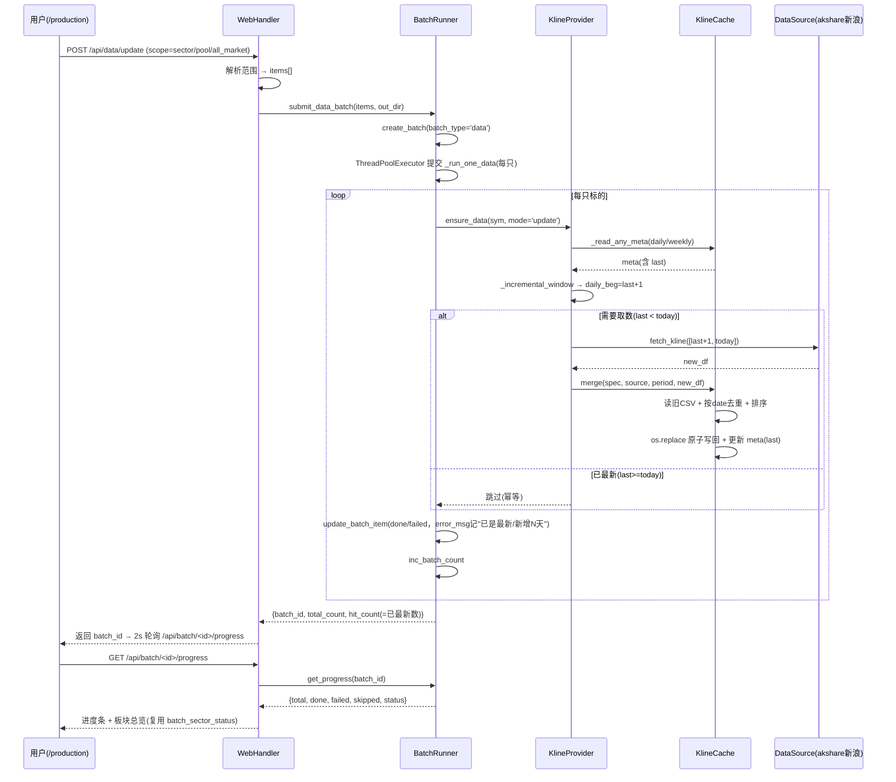
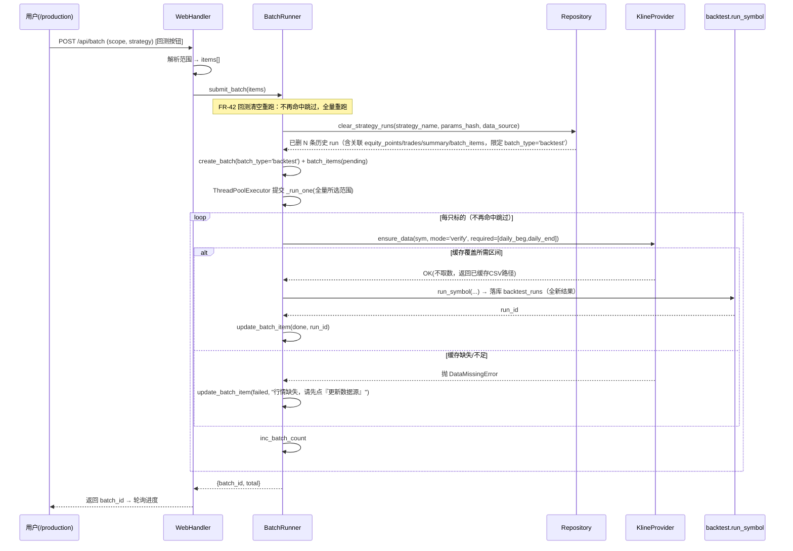

# Strategy Lab v3.0 大更新 — 设计方案（拆分预热 + 增量更新数据源）

> 项目：`E:\量化交易\strategy_lab`（Strategy Lab 量化回测平台）
> 版本：v3.0.0
> 状态：设计已确认，待实施
> 核心理念：**职责解耦（取数 vs 回测）+ 增量更新（append 而非覆盖）+ 时效可控**
> 架构铁律（沿用 v2.0）：不引入 Redis / Celery / RabbitMQ；仅用 Python 标准库 + 现有 MySQL/SQLite；复用现有资产；前端无框架

---

## 1. 升级背景与目标

### 1.1 现状（v2.0）与痛点

v2.0 的「全市场预热」（`/production` 页单一按钮 → `POST /api/batch/warmup-all`）把**两类职责耦合**在一处：

- **(a) 取行情**：从数据源拉日线/周线写 `data/` 缓存 CSV；
- **(b) 跑回测**：基于缓存跑策略落库 `backtest_runs`。

代码核查发现两个真实缺陷（见 `docs/需求文档.md` §11 与本文 §3）：

1. **全量覆盖（FR-39 要修）**：`provider.ensure_data` 取数请求的 `daily_end/weekly_end` 恒等于「今天」，而缓存 meta 存的 `end` 是上次运行实际取到的「最后交易日」。跨日重跑时「今天 > 缓存 meta.end」→ `_covers()` 判不覆盖 → **全量重拉 `[start-1年, 今天]` 整个历史区间**；`cache.save()`（`cache.py`）用 `os.replace` **整文件覆盖**，无 merge/append → 历史被截断、每天重复拉全量。
2. **取数被命中复用吞掉（FR-40 要解耦）**：`submit_batch` 用 `find_existing_runs`（`repository.py`）做命中预查，命中条件 = `strategy_name + params_hash + symbol + data_source`（**不比对日期区间**）。同策略重跑预热 → 所有标的被判命中 → 整个跳过 `run_symbol`/`ensure_data` → **数据完全不刷新**。这是「回测命中复用」与「数据更新」职责未分离导致的耦合 bug。

### 1.2 v3.0 目标

| 目标 | 说明 |
|---|---|
| **G1 职责解耦** | 将数据获取与回测执行彻底分离，各自独立触发、独立度量、独立失败。消除「回测命中复用导致数据不刷新」与「取数失败静默跳过回测」的耦合。 |
| **G2 增量更新** | 行情在已有缓存基础上按交易日**追加**新数据，避免每次重跑全量拉取整个历史区间，显著缩短更新耗时、降低数据源请求压力。 |
| **G3 时效可控** | 用户能明确感知行情新鲜度；数据陈旧时分析页引导「先更新数据源再重跑」，使回测建立在可信任行情之上。 |

---

## 2. 已确认决策（关键设计取舍）

| # | 决策点 | 选定方案 |
|---|--------|---------|
| 1 | data-only 批次如何建模 | **复用现有 `batches`/`batch_items` 表**，新增 `batch_type` 字段区分 `backtest`/`data`（不新建表）。data 批次不写 `backtest_runs`；`batch_items.run_id` 对 data 批次恒为 `NULL`。 |
| 2 | 新端点命名 | 新增 `POST /api/data/update`（更新数据源，写 `batch_type='data'` 批次，不落库 run）；`POST /api/batch` 保留为**回测入口**（语义不变）。 |
| 3 | `ensure_data` 取数模式 | 新增 `mode` 参数：`update`（增量取数 + merge 写回，FR-39）/ `verify`（仅校验覆盖，缺失即抛错、不取数，FR-40）。 |
| 4 | `cache.save` 改 merge | `save` 内部**先读旧 CSV → 按 `date` 合并去重 → 排序 → `os.replace` 原子写回**；`beg` 历史不丢，`last` 推进到今天。新增 `_incremental_window(meta, today, default_beg)` 基于 `meta.last` 计算取数起点。 |
| 5 | 幂等 / 续传如何成立 | 每次取数起点 = `meta.last + 1`；重复触发无新交易日则跳过（幂等）；网络中断时未写回则 `last` 不变、下次从末日继续（续传天然成立）。 |
| 6 | 回测缺数据报错策略 | `verify` 不覆盖 → 抛 `DataMissingError`，`batch_item` 标记 `failed` 并提示「行情缺失，请先点『更新数据源』」；绝不静默全量重拉。 |
| 7 | `warmup-all` 是否保留 | **保留** `POST /api/batch/warmup-all`，语义澄清为「全市场回测」（等同 all_market 回测按钮，不复用取数职责）；前端不再有独立「全市场预热」按钮（改由范围单选 `all_market` 提供）。 |
| 8 | `find_existing_runs` 是否改动 | **原方案被 FR-42 取代**：v3.0 初版定为「不改、命中复用仅用于回测结果复用」。FR-42（§41 / §11）要求「回测」按钮先清空该策略历史结果再全量重跑，故**回测主链路不再走命中复用跳过**。`find_existing_runs` 方法本身仍保留（供其它场景/调试用），但 `submit_batch` 不再用它跳过标的是（见决策 #11）。 |
| 9 | FR-41 时效阈值 | 复用 FR-31 的 **30 天**，抽为 `STALE_DAYS = int(os.environ.get("STRATEGALAB_STALE_DAYS", "30"))` 常量，FR-31 与 FR-41 共用；分析页文案改为明确引导至「更新数据源」按钮。 |
| 10 | schema 版本 | v2 → v3：`ALTER TABLE batches ADD COLUMN batch_type VARCHAR(16) NOT NULL DEFAULT 'backtest'`（幂等迁移，老数据回填为 `backtest`）。 |
| 11 | FR-42 回测清空重跑口径 | 回测入口（`submit_batch`）在执行回测逻辑**前**先按 `strategy_name + params_hash + data_source` **清空该策略全部历史 `backtest_runs` 及关联 `equity_points`/`trades`/`summary`/`batch_items`**（新增 `Repository.clear_strategy_runs(...)`），再全量重跑所选范围；**清空维度 = 策略全维度（不限所选范围）**，重跑仅覆盖本次所选范围；`batches` 清空调限定 `batch_type='backtest'`，避免误删 data 批次；历史仅保留最新一份（清空后重跑覆盖），不保留 N 份快照；`find_existing_runs` 不再用于回测主链路（见决策 #8 修订）。 |

---

## 3. 增量更新核心设计（重点）

### 3.1 问题回顾（为什么现在会全量覆盖）

`provider.ensure_data`（当前）以「请求区间是否 ⊆ 缓存区间」判定（`_covers`）：

- 取数请求 `daily_end = 今天`，但缓存 `meta.end` = 上次实际取到的**最后交易日**（通常比今天早 1~3 天，因周末/非交易日/数据未发布）。
- 跨日重跑：`今天 > meta.end` → `_covers` 返回 `False` → `need_daily=True` → **全量重拉 `[daily_beg=20220706, 今天]`**。
- `_try_fetch` 取回窗口数据后，`cache.save()` 用 `os.replace` **整文件覆盖** CSV，并写入 `meta.end = 今天`（请求 end，而非实际最后交易日）→ 缓存历史被截断风险 + 次日再度全量。

### 3.2 修复：由「全量重拉 + 覆盖」改为「按 last+1 增量 + merge 写回」

#### 3.2.1 `KlineCache._incremental_window`（新增）

```python
def _incremental_window(meta, today_yyyymmdd, default_beg):
    """返回本次应取数的起点 YYYYMMDD；无需取数返回 None。"""
    if not meta or not meta.get("last"):
        return default_beg                 # 无缓存 → 从 genesis 全量首拉
    last = meta["last"]                    # 实际最后交易日 YYYYMMDD
    if last >= today_yyyymmdd:
        return None                        # 已最新（含周末）→ 幂等跳过
    nxt = (parse_yyyymmdd(last) + timedelta(days=1)).strftime("%Y%m%d")
    return nxt                             # 从末日+1 起追加
```

#### 3.2.2 `KlineCache.merge`（新增，替代整文件覆盖）

```python
def merge(self, spec, source, period, new_df, out_dir):
    """读旧 CSV → 与 new_df 按 date 合并去重（保留较新）→ 排序 → 原子写回。"""
    csv_path = self._csv_path(out_dir, spec.prefix, source, period)
    old = pd.read_csv(csv_path) if csv_path.exists() else empty_df()
    combined = (pd.concat([old, new_df])
                  .drop_duplicates(subset=["date"], keep="last")
                  .sort_values("date").reset_index(drop=True))
    self._atomic_write_csv(combined, csv_path)
    # meta：beg 取 min(旧beg, 新首行)，end/last 取 max(实际末行)，rows=len
    self._atomic_write_meta(build_meta(combined, source), meta_path)
    return csv_path
```

#### 3.2.3 `KlineProvider.ensure_data` 改造（update 模式）

原 `_covers` 双重判定（含持锁二次检查）替换为**增量窗口判定**：

```
today = YYYYMMDD(今天)
daily_meta = _read_any_meta(out_dir, prefix, src, "daily")[0]
daily_beg = _incremental_window(daily_meta, today, DEFAULT_DAILY_BEG)   # 可能 None
need_daily = daily_beg is not None

weekly_meta = _read_any_meta(out_dir, prefix, src, "weekly")[0]
weekly_beg  = _incremental_window(weekly_meta, today, DEFAULT_WEEKLY_BEG)
need_weekly = weekly_beg is not None
```

持 `_SYMBOL_LOCKS[secid]` 锁后再做一次相同判定（防并发重复取），随后：

- `need_daily`：`_try_fetch(symbol, spec, "daily", daily_beg, today, lmt)` → `cache.merge(...)`；`lmt` 按窗口天数动态放大（`(days+10)*2`）避免截断。
- `need_weekly`：`_try_fetch(symbol, spec, "weekly", weekly_beg, today, lmt)` → `cache.merge(...)`。
  - **周线说明**：akshare 新浪源 `stock_zh_a_daily` 仅日线，周线由适配器 `resample("W-FRI")` 聚合（`akshare_src.py`）。周线增量窗口同样取 `last_weekly + 1`；若窗口不足一周则 resample 无新周五柱 → merge 空操作 → 周线 `last` 不变（幂等，下次再补）。详见 §12 风险 R4。
- 两者都不需要 → 直接返回已有 CSV 路径（幂等，不取数不写）。

#### 3.2.4 `verify` 模式（供回测使用，FR-40）

```
required_daily  = [daily_beg,  daily_end]   # 来自 run_symbol 的 warmup 窗口
required_weekly = [weekly_beg, weekly_end]
if not (_covers(daily_meta, *required_daily) and _covers(weekly_meta, *required_weekly)):
    raise DataMissingError(f"标的 {symbol} 行情缺失/不足，请先点『更新数据源』刷新后再回测")
return (daily_csv_path, weekly_csv_path)    # 不取数、不写
```

### 3.3 幂等 / 续传如何天然成立（验收对应 FR-39 第 3/4 条）

- **重复触发幂等**：`last >= today` → `_incremental_window` 返回 `None` → `need_*=False` → 不取数不写 → 第二次点「更新数据源」零追加。
- **中断续传**：若 `_try_fetch` 抛 `AllSourcesFailedError` → `ensure_data` 上抛 → 未执行 `merge` → `meta.last` 不变 → 下次从同一 `last+1` 继续。若取到部分数据（源未报错但行数偏少）→ `merge` 推进 `last` 到实际末日 → 下次从新末日续。两种情形均不重复已写数据。

### 3.4 回测清空重跑设计（FR-42，取代 FR-40 命中复用语义）

> FR-42（§41 / §11）要求：「回测」按钮触发时，先删除该策略（按 `strategy_name + params_hash + data_source` 维度）此前产生的**全部** `backtest_runs` 历史结果，再基于现有缓存行情（`verify` 模式，绝不重新取数）重新跑所选范围的回测，生成一份全新的、干净的结果集。**清空维度 = 策略全维度（不限所选范围）**；重跑仅覆盖本次所选范围。

#### 3.4.1 `Repository.clear_strategy_runs`（新增）

```python
def clear_strategy_runs(self, strategy_name: str, params_hash: str, data_source: str) -> int:
    """删除该维度下历史回测结果及关联明细，返回被删 run 数。
    - DELETE equity_points/trades/summary WHERE run_id IN (命中 runs)
    - DELETE batch_items WHERE run_id IN (命中 runs) AND batch_type='backtest'
    - DELETE backtest_runs WHERE strategy_name=? AND params_hash=? AND data_source=?
    - batches 共用表：清空时限定 batch_type='backtest' 且匹配维度，避免误删 data 批次
    整体在单事务内顺序执行；清空早于写（clear 在 create_batch 之前）。
    """
```

#### 3.4.2 `BatchRunner.submit_batch` 前置清空

`submit_batch` 在 `create_batch` **之前**调用 `clear_strategy_runs(strategy_name, params_hash, data_source)`；随后全量重跑所选范围（**不再命中跳过**），每只走 `ensure_data(mode='verify')`，缺数据抛 `DataMissingError`（沿用 FR-40 的 verify 报错，见 §3.2.4）。

#### 3.4.3 幂等 / 安全

- **顺序安全**：清空（DELETE）在写库（INSERT 新 runs）之前完成；同策略并发回测由既有 `_SYMBOL_LOCKS` / 单 batch 串行语义兜底，避免竞态导致新旧混写。
- **data 批次不受影响**：清空仅作用于 `batch_type='backtest'` 的 `batches`/`batch_items` 及 `backtest_runs` 子树；「更新数据源」写入的 data 批次与缓存 CSV 完全不动。
- **历史策略**：仅保留最新一份（清空后重跑覆盖），不保留 N 份快照（FR-42 已决议，见决策 #11）。

### 3.5 分析查询列表「最近买入日期」列（FR-43，P0）

> FR-43（见 `docs/需求文档.md` §11）要求：分析查询页（`/analysis`）查询列表新增一列「最近买入日期」，取值 = 该列表**每行**对应回测结果产生的 `trades` 中"建仓/买入时间"字段的**最大值**（最近一次买入日期）；该列支持正序/倒序排序，扩展 `/api/rank` 的 `sort_by` 白名单新增 `last_buy_date`；无交易/无买入记录时显示"—"。

#### 3.5.1 字段来源（代码实测，已查证）

- **trades 表"买入/建仓时间"真实字段名 = `entry_date`**（`engine/storage/schema.py:99`：`entry_date: Mapped[datetime.date] = mapped_column(Date)`；详情页国际化键 `trades_col_entry_date` 显示文案为「开仓日」，见 `engine/vendor/dashboard_locales.py:65`）。
- **无需 `side` 过滤**：trades 仅存 A 股多头持仓，`side` 固定为 `'long'`（见 `schema.py:101` 注释 `# long` 与 `engine/vendor/export_results.py` 的"Enforce A-share long-only"防御校验），不存在 buy/sell 分表或 `side='buy'/'sell'` 之分；每一条 trade 即一次建仓，`entry_date` 即买入/建仓日期。故 `last_buy_date = MAX(trades.entry_date)`，**不附加 side 条件**。
- 空值处理：该行 run 无 trades（如回测 0 笔成交）时 `MAX` 为 `NULL`，前端显示"—"。

#### 3.5.2 列表行粒度（代码实测，已查证）

- `repository.rank_runs`（`engine/storage/repository.py:653`）的查询单元是 `BacktestRun`（每个 run = 单标的 × 策略 × params_hash）；构建 `items` 时**按 `symbol` 去重、仅保留 `_created_at` 最新的一条**（见 `repository.py:736-743` 的 `seen` 去重逻辑）。
- 因此列表**每行 = 一个 symbol 的最新一条 run**，行粒度与「每行 run」等价（去重后每行唯一对应一个 `run_id`）。FR-43 推荐的"按每行 run 取各自 trades 的最大买入日期"与现有行粒度一致，**直接采用**：`last_buy_date` 取**该行 run**（去重后保留的 run）的 `trades.entry_date` 最大值。

#### 3.5.3 取数方式（聚合子查询，避免 N+1）

- 落点：`engine/storage/repository.py` 的 `rank_runs`（在已有 `all_rows` 循环后、去重前后均可），用**一条分组 MAX 聚合**按 `run_id` 算 `last_buy_date`，随行写入 item，避免逐 run 查 trades 的 N+1：

  ```python
  run_ids = [r.run_id for r in all_rows]
  sub = (
      s.query(Trade.run_id, func.max(Trade.entry_date).label("last_buy_date"))
       .filter(Trade.run_id.in_(run_ids))
       .group_by(Trade.run_id)
       .all()
  )
  buy_map = {rid: (d.isoformat() if d else None) for rid, d in sub}
  # 写入 item： "last_buy_date": buy_map.get(r.run_id)   # None 表示无买入记录
  ```

  - 返回值用 ISO 字符串 `YYYY-MM-DD`（与现有 `end` 字段一致调用 `isoformat()`，便于 JSON 序列化）；无 trades 的 run → `None`。
  - **不冗余存储**：`summary` 表无建仓相关字段（见 `schema.py:116-128`，仅含收益/回撤/夏普/胜率等），故采用随行聚合计算，而非在 `summary` 新增列，保持最小变更。

#### 3.5.4 排序（扩展 `sort_by` 白名单，沿用 FR-20/21）

- 落点：`repository.rank_runs` 的 `_ALLOWED_SORT` 集合（现有 `repository.py:746-752`）**新增 `'last_buy_date'`**。
- 排序规则**完全沿用现有 NULL 末位 + 翻页守卫**：
  - 升序 = 正序（`order='asc'`）、降序 = 倒序（`order='desc'`）；`last_buy_date` 为 `None` 的行（无买入记录）**统一排到末尾**（沿用 `rank_runs` 现有 `_body=[x for x in items if x.get(sort_by) is not None]` + `_nils` 末位逻辑，对 `date`/ISO 字符串均成立）。
  - `order` 仅接受 `asc`/`desc`，非法回退 `desc`（沿用 `_api_rank` 现有解析，见 `web.py:1054-1056`）。
  - 切换排序后页码重置回第 1 页（前端 `sortBy()` 调 `loadRank(1)`，沿用 FR-21 翻页守卫；前端 `curSortBy`/`curSortDir` 状态管理已具备）。
- 前端交互落点：见 §8（T-43）/`web.py build_analysis_html`（新增列 + 列头排序，空值"—"）。

---

## 4. 数据模型 / 接口（类图）

```mermaid
classDiagram
    %% ===== 存储层 =====
    class Batch {
        +String batch_id PK
        +String strategy_name
        +String strategy_type
        +String params_hash
        +String scope_type
        +String scope_value
        +String batch_type : 新增，区分 backtest/data
        +int total_count
        +int done_count
        +int failed_count
        +int skipped_count
        +String status
        +DateTime started_at
        +DateTime finished_at
        +DateTime created_at
    }
    class BatchItem {
        +int id PK
        +String batch_id FK
        +String symbol
        +String symbol_name
        +String sector_code
        +String status
        +String run_id : data 批次恒为 NULL
        +bool is_reused
        +Text error_msg : data 批次可存"已是最新/新增N天"
        +DateTime started_at
        +DateTime finished_at
    }
    class BacktestRun {
        +String run_id PK
        +String strategy_name
        +String params_hash
        +String symbol
        +Date end : FR-41 时效判定基准
        +String data_source
    }

    %% ===== 数据源层 =====
    class KlineCache {
        +load(spec, source, period, beg, end, out_dir) DataFrame
        +save(spec, source, period, df, beg, end, out_dir) Path
        +merge(spec, source, period, new_df, out_dir) Path : 读旧+合并去重+写回
        +_covers(meta, beg, end) bool
        +_incremental_window(meta, today, default_beg) String : 返回 last+1 或 None
        +_read_any_meta(out_dir, prefix, source, period) tuple
        +_atomic_write_csv(df, path) int
        +_atomic_write_meta(meta, path)
    }
    class KlineProvider {
        +ensure_data(symbol_cfg, out_dir, ..., mode, required_beg, required_end) tuple : mode='update'|'verify'
        -_try_fetch(symbol, spec, period, beg, end, lmt) DataFrame
    }
    class DataSource {
        <<interface>>
        +fetch_kline(symbol, klt, beg, end, lmt) DataFrame
    }
    class DataMissingError {
        +str symbol : verify 模式行情不足时抛出
    }

    %% ===== 执行层 =====
    class BatchRunner {
        +submit_batch(...) tuple : 回测，FR-42 前置 clear_strategy_runs + 全量重跑
        +submit_data_batch(...) tuple : 更新数据源，不落库 run
        -_run_one(...) : 回测单只
        -_run_one_data(...) : 数据单只 ensure_data(mode='update')
        +get_progress(batch_id) dict
        +cancel_batch(batch_id) bool
        +init_batch_runner()
    }
    class Repository {
        +find_existing_runs(strategy_name, params_hash, symbols, data_source) dict : 保留，回测主链路不再用
        +clear_strategy_runs(strategy_name, params_hash, data_source) int : FR-42 前置清空(限定 batch_type='backtest')
        +create_batch(...) : 新增 batch_type 形参
        +rank_runs(...) dict : FR-41 用 STALE_DAYS
        +batch_sector_status(batch_id) list : data/backtest 复用
    }

    %% ===== Web 层 =====
    class WebHandler {
        +_api_data_update() : POST /api/data/update
        +_api_submit_batch() : 回测入口（不变）
        +_api_batch_progress(batch_id) : data/backtest 复用
        +build_production_html() : FR-37 双按钮
        +build_analysis_html() : FR-41 stale 文案
    }

    %% ===== 关系 =====
    Batch "1" *-- "0..*" BatchItem : contains
    BatchItem }o--o| BacktestRun : run_id(可空)
    KlineProvider ..> KlineCache : 读写缓存
    KlineProvider ..> DataSource : fetch
    KlineProvider ..> DataMissingError : 抛错(verify)
    BatchRunner ..> KlineProvider : ensure_data(mode)
    BatchRunner ..> Repository : 批次CRUD/进度
    Repository ..> Batch
    Repository ..> BatchItem
    WebHandler ..> BatchRunner : submit_data_batch / submit_batch
    WebHandler ..> Repository : rank / sector_status
    BacktestRun ..> KlineCache : 取数(经 provider)
```

**要点**：`batch_type` 仅加在 `Batch` 上；`BatchItem` 完全复用（data 批次 `run_id=NULL`、用 `error_msg` 承载「已是最新/新增N天」信息）。`find_existing_runs` 方法实现不改动，但 FR-42 后回测主链路不再用它做命中跳过（改由 `clear_strategy_runs` 前置清空 + 全量重跑，见 §3.4 / §11）。

---

## 5. API 端点设计

### 5.1 新增端点

| Method | Path | 用途 | 语义边界 |
|--------|------|------|---------|
| `POST` | `/api/data/update` | **更新数据源**（data-only 批次）：仅取数写缓存，不回测、不落库 `backtest_runs` | 入参 `scope_type`(sector/pool/all_market) + `scope_value`/`symbols`；返回 `{batch_id, total_count, hit_count}`（`hit_count` = 已是最新数）。 |

### 5.2 修改 / 澄清端点

| Method | Path | 变更 |
|--------|------|------|
| `POST` | `/api/batch` | **回测入口（FR-42 语义变更）**。FR-42 起 `submit_batch` 不再走 `find_existing_runs` 命中复用；改为 `create_batch` 前先 `clear_strategy_runs(strategy_name, params_hash, data_source)` 清空该策略全部历史结果，再全量重跑所选范围；`_run_one` 内 `run_symbol` 仍以 `ensure_data(mode='verify')` 校验行情，缺失即 `failed` 报错（沿用 FR-40）。 |
| `GET` | `/api/batch/<id>/progress` | **data/backtest 复用**（data 批次也在 `batches` 表）。返回 `{total, done, failed, skipped, running, status, current_symbol, eta_seconds}`，对 data 批次含义一致。 |
| `POST` | `/api/batch/<id>/cancel` | **data/backtest 复用**（共用 `_CANCEL_FLAGS`）。 |
| `GET` | `/api/batch` | 批次列表（data 与 backtest 混合）。前端按 `batch_type` 区分展示「行情更新 / 回测」。 |
| `POST` | `/api/batch/warmup-all` | **保留**，语义澄清为「全市场回测」（等同 all_market 回测按钮，不复用取数职责）。前端不再暴露该按钮，改由范围单选 `all_market` 覆盖。 |
| `GET` | `/api/rank` | **FR-43 扩展**：返回 item 新增 `last_buy_date` 字段（ISO `YYYY-MM-DD`，无买入记录为 `null`）；`sort_by` 白名单新增 `last_buy_date`（升序=正序、降序=倒序，NULL 末位，沿用 FR-20/21）；翻页守卫沿用 FR-21（切换排序回第 1 页）。`rank_runs` 用一条分组 MAX 聚合（`MAX(trades.entry_date)` 按 `run_id`）算 `last_buy_date`，避免 N+1；行粒度 = 每行 run（去重后每个 symbol 最新 run）。 |

> 设计取舍：`/api/data/update` 与 `/api/batch` 共用 `batches`/`batch_items` 表与进度/取消/板块总览/重启-interrupted 全套机制，仅 `batch_type` 区分，最大化复用（呼应决策 #1）。

---

## 6. 前端「更新数据源」+「回测」两个按钮设计（/production 页改造，FR-37）

沿用现有 `build_production_html` 模板结构，改动最小：

### 6.1 表单区

- **范围单选**：由 2 项（sector / pool）扩为 **3 项**：`按板块` / `自定义池` / `全市场`。`全市场` 即原「全市场预热」的等价范围（统一到范围单选，去掉独立预热按钮）。
- **两个独立操作按钮**（替代原「提交批量扫描」+「🌐 全市场预热」）：
  - `💾 更新数据源` → `POST /api/data/update`（`scope=...` 复用当前范围单选）。
  - `🚀 回测` → `POST /api/batch`（现有回测入口）。
- 两者**互斥语义但可先后点**：先「更新数据源」刷新行情，再「回测」跑结果；也可只点其一。

### 6.2 进度 / 板块总览 / 取消 / 历史（全部复用）

- 进度区 `batch-info`、2s 轮询 `poll()`、`cancelBatch()`、`loadSectorStatus()`（`/api/sector-status`）、历史批次 `loadBatches()`（`/api/batch`）**完全复用**，因 data 批次也在 `batches` 表。
- `beginBatch(d)` 后根据返回 `batch_type`（前端可从 `batch-info` 隐藏字段或 `loadBatches` 行类型判断）切换完成提示文案：
  - data 批次完成 → 「✅ 行情已更新，可前往分析页或重新『回测』」。
  - backtest 批次完成 → 现有「✅ 批次已完成，前往分析查询页」。

### 6.3 前端 JS 改动点（概要，非实现）

- 新增 `updateData()` 函数：`fetch('/api/data/update', {method:'POST', body:fd})` → `beginBatch(d)`。
- `submitForm()` 重命名为 `runBacktest()`（保持 `POST /api/batch`）。
- 范围单选增加 `all_market` 分支（复用 `_expand_all_market` 由后端处理）。

---

## 7. 程序调用流程（时序图）

### 7.1 更新数据源全流程（FR-38/39，data-only 批次）



### 7.2 回测全流程（FR-42，清空重跑 + verify-only，不取数）



---

## 8. 任务清单（有序、含依赖、按实现顺序）

> 覆盖 FR-37~42 的实现 tasks。P0 必须有 / P1 应该有。每个 task 标注涉及文件（对齐 §9 文件清单）。

| 任务 | 对应 FR | 标题 | 依赖 | 优先级 | 涉及文件 |
|------|---------|------|------|--------|---------|
| T-39 | FR-39 | 增量更新核心：`cache.merge` + `_incremental_window` + `provider.ensure_data(mode='update')` | 无 | P0 | `engine/datasource/cache.py`、`engine/datasource/provider.py`、`engine/datasource/__init__.py` |
| T-38 | FR-38 | 更新数据源独立批次执行器：`submit_data_batch` + `_run_one_data`（不落库 `backtest_runs`） | T-39 | P0 | `engine/batch_runner.py`、`engine/datasource/provider.py`（mode 参数已在 T-39 落地）、`engine/datasource/exceptions.py`（新增 `DataMissingError`） |
| T-40 | FR-40 | 回测 verify-only 缺数据报错（**不再命中跳过**）：`ensure_data(mode='verify')` 透传 + `run_symbol` 改 verify + `DataMissingError` 文案；命中复用语义已由 FR-42 移除（见 T-42） | T-39 | P0 | `engine/datasource/provider.py`（mode='verify'）、`engine/data_feed.py`（shim 透传 mode/required）、`engine/backtest.py`（run_symbol 改 verify）、`engine/datasource/exceptions.py` |
| T-37 | FR-37 | 前端拆分双按钮 + 新端点 + 批次类型落库：新增 `POST /api/data/update`、`/production` 两按钮、`build_production_html` 完成提示分流、`Batch` 加 `batch_type`、迁移 v2→v3 | T-38, T-40 | P0 | `web.py`、`engine/storage/schema.py`、`engine/storage/repository.py`、`engine/storage/migrate.py` |
| T-41 | FR-41 | 数据时效提示增强：`STALE_DAYS` 常量化 + 分析页 stale 文案引导至「更新数据源」 | 无 | P1 | `engine/storage/repository.py`、`web.py`、`docs/使用指南.md` |
| T-42 | FR-42 | 回测清空重跑：`Repository.clear_strategy_runs(strategy_name, params_hash, data_source)` + `submit_batch` 前置清空调用 + 移除 `find_existing_runs` 命中跳过（**修改 T-40 的回测入口语义**） | T-40 | P0 | `engine/storage/repository.py`（新增 `clear_strategy_runs`）、`engine/batch_runner.py`（`submit_batch` 前置清空）、`engine/storage/schema.py`（如需关联 FK 说明） |
| T-DOC | — | 文档与指南同步：CHANGELOG 追加章节、使用指南按钮说明、技术文档同步 | T-37, T-41 | P1 | `docs/CHANGELOG.md`、`docs/使用指南.md`、`docs/技术文档.md` |
| T-43 | FR-43 | 分析查询列表新增「最近买入日期」列 + 排序：`repository.rank_runs` 聚合计算 `last_buy_date`（分组 `MAX(trades.entry_date)`，避免 N+1；字段名已查证为 `entry_date`）+ `_ALLOWED_SORT` 白名单扩展（新增 `last_buy_date`，NULL 末位）+ 前端 `build_analysis_html` 新增列与列头排序交互（空值"—"） | T-37 | P0 | `src/strategylab/engine/storage/repository.py`、`src/strategylab/web.py` |

**实现顺序建议**：T-39 → T-38 → T-40 → T-42 → T-37 →（并行）T-41 / T-43 / T-DOC。T-39 是地基（增量合并），T-38/T-40 共用其 `mode` 能力；T-42 在 T-40 之后落地，把回测入口从「命中复用跳过」改为「清空重跑」；T-37 把三者串成用户可见的双按钮；T-41 为体验增强可后置。**T-42 与 T-40 关系**：T-42 **修改 T-40 的回测入口语义**（移除命中跳过、增加 `submit_batch` 前置 `clear_strategy_runs`），二者同属回测主链路，T-42 依赖 T-40 的 verify 能力先就绪。**T-43（FR-43）**：依赖 T-37（前端分析页基础表格已就位）即可在 T-37 之后或与其并行落地；仅扩展 `rank_runs` 的聚合子查询与 `sort_by` 白名单 + 前端 `build_analysis_html` 新增一列，不改动双按钮/回测主链路；与 T-41 并行无冲突（二者均只动 `rank_runs`/`build_analysis_html` 的不同字段，合并时注意同函数多字段即可）。

---

## 9. 文件清单

### 新增

- `docs/v3.0-design.md` — 本文（3.0 增量设计 + 实现计划）。

### 修改

- `src/strategylab/engine/datasource/cache.py` — 新增 `merge()`、`_incremental_window()`；`save()` 内部改 merge（历史不丢）；meta 存「实际末日」而非请求 end。
- `src/strategylab/engine/datasource/provider.py` — `ensure_data` 新增 `mode`(`update`/`verify`)、`required_beg/required_end` 形参；`update` 模式用增量窗口 + `cache.merge`；`verify` 模式仅校验、缺失抛 `DataMissingError`；模块级 `ensure_data` 同步签名。
- `src/strategylab/engine/datasource/__init__.py` — 如需导出 `get_provider`/`ensure_data` 或 `DataMissingError` 则补充（保持对外接口稳定）。
- `src/strategylab/engine/datasource/exceptions.py` — 新增 `DataMissingError`（供 verify 模式缺数据时报错）。
- `src/strategylab/engine/data_feed.py` — `ensure_data` shim 透传 `mode`/`required_beg`/`required_end` 到 `provider.ensure_data`（兼容现有调用方）。
- `src/strategylab/engine/backtest.py` — `run_symbol` 内 `ensure_data(...)` 改为 `ensure_data(..., mode='verify', required_beg=daily_beg, required_end=fetch_end)`（回测不再取数）。
- `src/strategylab/engine/batch_runner.py` — 新增 `submit_data_batch(...)` + `_run_one_data(...)`（data-only，不落库 run）；**`submit_batch` 在 `create_batch` 前调用 `Repository.clear_strategy_runs(strategy_name, params_hash, data_source)`（FR-42 前置清空，不再命中跳过）**；复用 `_CANCEL_FLAGS`/`get_progress`/`cancel_batch`/`init_batch_runner`；`create_batch` 调用带 `batch_type='data'`/`'backtest'`。
- `src/strategylab/engine/storage/schema.py` — `Batch` 加 `batch_type: Mapped[str]`（默认 `'backtest'`）。
- `src/strategylab/engine/storage/repository.py` — `create_batch` 加 `batch_type='backtest'` 形参并写入；`rank_runs` 用 `STALE_DAYS` 常量替代硬编码 `30`；`list_batches` 返回含 `batch_type`；**新增 `clear_strategy_runs(strategy_name, params_hash, data_source)`**：事务内顺序 DELETE 该维度下 `backtest_runs` 及关联 `equity_points`/`trades`/`summary`/`batch_items`（清空调限定 `batch_type='backtest'`，避免误删 data 批次）。**FR-43 扩展**：`rank_runs` 在已有 `all_rows` 后加一条分组 `MAX(trades.entry_date)` 聚合（按 `run_id`，`Trade.entry_date` 已查证为真实字段名）算 `last_buy_date` 随行返回（无 trades 为 `None`）；`_ALLOWED_SORT` 白名单新增 `'last_buy_date'`（`None` 末位、翻页守卫沿用 FR-20/21）；`summary` 表不冗余存储该字段。
- `src/strategylab/engine/storage/migrate.py` — 新增 `migrate_v2_to_v3`：`ALTER TABLE batches ADD COLUMN batch_type VARCHAR(16) NOT NULL DEFAULT 'backtest'`；`init_db` 版本检测 v2→v3（幂等）。
- `src/strategylab/web.py` — 新增 `POST /api/data/update` 处理（`_api_data_update`）；`build_production_html` 改双按钮 + 范围单选加 `all_market` + 完成提示按 `batch_type` 分流；`build_analysis_html` 的 stale 文案改为引导「更新数据源」；`do_POST` 路由加 `/api/data/update`。**FR-43 扩展**：`build_analysis_html` 排名表在「胜率」列后新增「最近买入日期」列（来源 item.`last_buy_date`，ISO `YYYY-MM-DD`，`null`→"—"）；列头 `cols` 数组新增 `['last_buy_date','最近买入日期',true]` 使其可点击排序（asc/desc 切换、当前列金色 ▲/▼、切列回第 1 页，沿用 FR-21）；`rowHtml` 新增该列单元格渲染；`_api_rank` 透传 `sort_by/order` 逻辑不变（白名单在 `repository.rank_runs` 内校验）。
- `docs/使用指南.md` — §10.5.2 数据生产页：说明「更新数据源」「回测」双按钮与各自范围；FR-41 时效提示文案。
- `docs/技术文档.md` — 同步 v3.0 架构扩展（数据模型/增量更新/双按钮 API/verify 模式）。
- `docs/CHANGELOG.md` — 追加「十、3.0 大更新（拆分预热 + 增量更新数据源）— 规划中」章节。

### 不动（明确边界）

- `src/strategylab/engine/storage/repository.py` 的 `find_existing_runs` — **方法实现不改动**（仍保留，供调试/其它场景）；但 FR-42 后回测主链路 `submit_batch` 不再调用它做命中跳过（见决策 #8 修订 / #11）。
- `src/strategylab/engine/strategies/*`、`indicators.py`、`search.py`、`dashboard.py`、`config.py`、`vendor/*` — 策略/指标/搜索/渲染不变。
- 数据源适配器（`akshare_src.py`/`eastmoney.py`/`tushare.py`/`base.py`/`factory.py`/`config.py`/`switch_log.py`/`broker.py`/`cli_status.py`）— 取数契约不变，仅上层编排改增量。

---

## 10. 依赖包列表

**无新增第三方依赖。** 沿用现有：`pandas`（缓存合并/去重/resample）、`akshare`（新浪源取数，已依赖）、SQLAlchemy（存储层，已依赖）。零额外依赖，符合「前端无框架、后端标准库 + 现有 MySQL/SQLite」铁律。

---

## 11. 共享知识（跨文件约定）

- **meta 字段 `last` 语义**：`<prefix>_<source>_<period>_meta.json` 中 `last` = 缓存中**实际最后交易日**（`YYYYMMDD`），是增量起点判定的唯一依据；`end` 与 `last` 一致（存实际末日，而非请求 end）。`beg` = 历史最早日，merge 后不回退。
- **merge 去重规则**：按 `date` 列去重，`keep='last'`（新数据覆盖同日旧数据）；合并后按 `date` 升序；原子写用临时文件 + `os.replace`（沿用 FR-19）。
- **增量窗口规则**：取数起点 = `meta.last + 1` 个日历日；`last >= 今天` → 不取数（幂等）。日线/周线各自独立计算起点（周线末日通常为周五）。
- **`mode` 约定**：`update` = 取数并 merge 写回（仅「更新数据源」用）；`verify` = 仅校验缓存覆盖所需区间，不足抛 `DataMissingError`，绝不取数（仅「回测」用）。
- **批处理状态语义**：`batches.status` 沿用 `pending/running/done/failed/cancelled/interrupted`；data 批次 `batch_type='data'`、`batch_items.run_id=NULL`；`skipped_count` 在 data 批次中表示「已是最新（无新增）」数；`error_msg` 在 data 批次可承载「已是最新 / 新增 N 天」信息。
- **`STALE_DAYS`**：`int(os.environ.get("STRATEGALAB_STALE_DAYS", "30"))`，FR-31 与 FR-41 共用，单一真相源。
- **`DataMissingError`**：verify 模式行情不足时抛出，web 层捕获后转 `failed` + 明确文案「请先点『更新数据源』」，不静默、不回退全量重拉。
- **并发安全**：data 与 backtest 批次共用 `_SYMBOL_LOCKS`（进程内 per-secid 锁）与 `os.replace` 原子写，互不损坏缓存。
- **回测清空重跑约定（FR-42）**：回测入口 `submit_batch` 先 `clear_strategy_runs(strategy_name, params_hash, data_source)` 再 `verify` 重跑；清空维度 = `strategy_name + params_hash + data_source`（策略全维度，不限所选范围），重跑仅覆盖本次所选范围；`batches`/`batch_items` 清空调限定 `batch_type='backtest'`，绝不波及 `data` 批次与缓存 CSV；清空在 `create_batch` 之前完成（顺序安全，无竞态）；历史仅保留最新一份（清空后重跑覆盖）。
- **最近买入日期约定（FR-43）**：分析查询列表「最近买入日期」列取值 = `MAX(trades.entry_date)`（字段名已查证为 `entry_date`，`schema.py:99`；trades 仅 A 股多头 `side='long'`，无需 side 过滤），按**每行 run**（去重后每个 symbol 最新 run，`rank_runs` 行粒度）取该 run 的 trades 最大值；无买入记录 → `NULL` → 前端显示"—"。排序：`sort_by` 白名单新增 `last_buy_date`，升序=正序/降序=倒序，`NULL` 统一排末尾（沿用 FR-20 的 None 末位规则），切换排序回第 1 页（沿用 FR-21 翻页守卫）；返回值为 ISO `YYYY-MM-DD` 字符串，便于 JSON 序列化；不在 `summary` 冗余存储，由 `rank_runs` 分组聚合随行计算（避免 N+1）。

---

## 12. 风险与缓解

| # | 风险 | 等级 | 缓解 |
|---|------|------|------|
| R1 | 增量取数遇**停牌/长期无交易**标的，日期空洞 | 中 | `_incremental_window` 从 `last+1` 起；akshare 对停牌段返回空行，merge 后 `last` 停在停牌前末日；复牌后下次自然续传。前端/进度以「已是最新」呈现，不报错。 |
| R2 | **周线由日线聚合**的边界（`resample("W-FRI")`）：增量窗口不足一周时 resample 无新周五柱 | 中 | 周线增量窗口取 `last_weekly + 1`；窗口 < 一周时 merge 空操作、`last` 不变（幂等，下次再补）。如追求更稳，可改为「周线由更新后的日线 CSV 直接 resample 重算」（纯函数，无独立取数），作为可选实现路径。 |
| R3 | **并发同标的锁**：data 与 backtest 批次可能对同标的取数/校验 | 低 | 复用既有 `_SYMBOL_LOCKS[secid]` 进程内锁；`ensure_data` 持锁内二次判定窗口，避免重复取数。 |
| R4 | **续传一致性**：`_try_fetch` 部分成功（源未报错但行数偏少） | 低 | `merge` 仅写实际取回数据，`last` 推进到实际末日；下次从新末日续，不重复已写。整文件 `os.replace` 原子写保证不会写半截 CSV。 |
| R5 | **meta 损坏/缺失**：旧缓存无 meta 或 meta 解析失败 | 低 | `_read_any_meta` 返回 `None` → 视为无缓存 → `_incremental_window` 返回 `default_beg` → 全量首拉（与现状一致，安全回退）。 |
| R6 | 老 `backtest_runs` 因 `end` 老旧被 FR-41 标「较旧」误导用户 | 低 | 文案明确引导「先点更新数据源再重跑」；`end` 仍以实际回测区间末日为准，与行情 `last` 解耦显示。 |
| R7 | `warmup-all` 语义变更导致 CLI/脚本调用方困惑 | 低 | 文档与 CHANGELOG 明确澄清「全市场回测」；保留端点不删，向后兼容。 |
| R8 | MySQL `ALTER TABLE` 加 `batch_type` 在大表上锁表 | 低 | 在 `batches` 上加 `NOT NULL DEFAULT 'backtest'`（MySQL 8 / SQLite 均支持 online-ish 或瞬时，因批次表量小）；迁移幂等、可重跑。 |

---

## 13. 待明确事项（本次已决议，列此备查）

> 以下原属「待明确」，已在 §2 决策表中**确认**，列出仅为追溯：

1. **`warmup-all` 是否保留** → 保留，语义澄清为「全市场回测」（决策 #7）。
2. **`batch_type` 是否落库字段** → 是，新增 `Batch.batch_type` 字段（决策 #1/#10）。
3. **FR-41 阈值是否复用 30 天** → 复用，抽 `STALE_DAYS` 常量（决策 #9）。
4. **周线增量实现路径** → 默认走适配器现有「取日线→resample」+ merge（决策 #4 / §3.2.3）；备选「由日线 CSV 重算周线」作为可选优化（§12 R2）。
5. **data 批次是否记录「新增天数」** → 默认复用 `batch_items.error_msg` 记「已是最新/新增 N 天」，不新增 `fetched_days` 列（最小变更）；如后续需精确统计可再加列（v4 议题）。
6. **FR-42 回测清空范围与历史保留** → 清空按「`strategy_name + params_hash + data_source` 策略全维度」清空**全部**历史结果（不限所选范围，因用户说"所有"）；重跑仅覆盖本次所选范围；历史**仅保留最新一份**（清空后重跑覆盖），不保留 N 份快照（决策 #11）。

---

## 附录 A：与 v2.0 的关系

- v3.0 是 **v2.0 FR-23「全市场预热」的拆分与改造**，不推翻 v2.0 的「两页解耦 + 一次跑多次查」核心理念，而是把「预热」按钮内耦合的取数/回测**显式拆成两个按钮**，并把取数从「全量覆盖」升级为「增量追加」。
- v2.0 建立的 `batches`/`batch_items`、命中复用、`/api/batch*`、进度/取消/板块总览/重启-interrupted 全部**复用**，仅新增 `batch_type` 维度与 `/api/data/update` 端点。
- 详细 v2.0 设计见 `docs/v2.0-design.md`；3.0 需求原文见 `docs/需求文档.md` §11（FR-37~41）。
