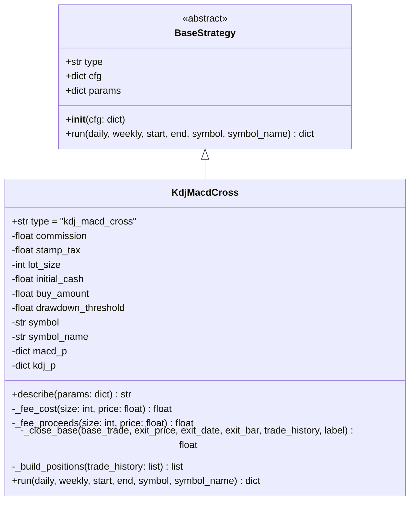

# Strategy Lab 4.0 新策略：日线 KDJ 监控 + MACD 金叉买入 — 系统架构设计 + 任务分解

> 架构师：**高见远（software-architect）**　|　日期：2026-07-20
> 输入：`docs/需求文档.md` §4.0（REQ-01~09）+ 已确认语义（产品/主理人）
> 落盘：`docs/v4.0-design.md`、`docs/v4.0-class-diagram.mermaid`、`docs/v4.0-sequence-diagram.mermaid`

---

## 1. 实现方案 + 框架选型

**一句话结论**：完全沿用现有策略框架（`BaseStrategy` 子类 + `strategies/__init__.py` 自动扫描注册 + `config.py` 自动加载 toml），**零中心代码改动**即可上线；唯一的必要小改动是给 `engine/indicators.py` 的 `compute_kdj` 增加一个**向后兼容的可选参数**（详见 §3 / T1），其余全部为「新增文件」。

### 1.1 新策略命名与落点（拍板）

| 项 | 值 | 说明 |
|----|----|------|
| 策略类 | `KdjMacdCross` | 继承 `BaseStrategy` |
| `type` 类属性 | `"kdj_macd_cross"` | 必须唯一；自动注册表以 `cls.type` 建表 |
| 策略文件 | `src/strategylab/engine/strategies/kdj_macd_cross.py` | 新建 |
| 配置文件 | `src/strategylab/resources/strategies/kdj_macd_cross.toml` | 新建，`type` 须匹配 |
| 展示名 | `"日线KDJ监控 + MACD金叉买入"` | `name` 字段 |

> 命名沿用 `kdj_macd_dual_entry` 的 `<因子>_<信号>` 风格，语义明确：KDJ 负责"监控武装"，MACD 负责"金叉买入/死叉清仓"。

### 1.2 框架事实核对（已 Read 确认，作为设计前提）

| 文件 | 关键结论 |
|------|----------|
| `engine/strategies/base.py` | `BaseStrategy`：`type` 类属性 + `__init__(cfg)`（取 `cfg["params"]`）+ `run(daily, weekly, start, end, symbol, symbol_name) -> {equity_curve, trade_history, positions}` |
| `engine/strategies/__init__.py` | `discover_strategies()` 扫描本目录 `*.py`，收集**本模块定义**的 `BaseStrategy` 子类、`type` 建表；`type` 冲突即抛 `TypeError` → **新增文件即注册，零中心改动** |
| `engine/indicators.py` | `compute_macd(close, fast, slow, signal) -> (dif, dea, hist)` ✅ 够用；`compute_kdj(df, n, m1, m2) -> pd.Series(j)` ⚠️ **只返回 J，不返回 K/D** |
| `engine/strategies/kdj_macd_dual_entry.py` | 复用模板：`_fee_cost` / `_fee_proceeds` / `_close_base` / `_build_positions`；死叉判定公式 `death_cross = (dif.shift(1) >= dea.shift(1)) & (dif < dea)`；`describe(params)` 自描述文案 |
| `engine/resources/strategies/kdj_macd_dual_entry.toml` | 参数结构范本：`initial_cash` / `commission` / `stamp_tax` / `lot_size` / `execution="same_day_close"` / `[params.macd]` / `[params.kdj]` |
| `engine/backtest.py` | `run_symbol` 一次只跑**一个 symbol**（`get_strategy_class(type)` → `cls(cfg)` → `run(...)`）；最后交给 `export_results(write_files=False)` + `repository.save_run` 落库 |
| `engine/config.py` | 扫描 `resources/strategies/*.toml` + 用户目录；`name`/`type` 自动发现 → 前端下拉与 CLI `list-strategies` 自动可见 |

### 1.3 关键技术决策一览（与 §8 待明确事项呼应）

| # | 决策点 | 结论（拍板） |
|---|--------|--------------|
| D1 | KDJ 金叉取列 | `compute_kdj` 增加可选 `return_full=False`；`True` 时返回含 `K/D/J` 的 `DataFrame`，`False`（默认）保持原 J `Series` 不变。**金叉 = K 上穿 D**（金叉当日收盘价判定） |
| D2 | MACD 金叉/死叉取列 | 直接用 `compute_macd` 返回的 `dif/dea`；金叉 `dif_prev<=dea_prev 且 dif>dea`；死叉 `dif_prev>=dea_prev 且 dif<dea`（任意位置，不限 0 轴） |
| D3 | 执行价 + 偏差声明 | 买入/清仓 = **当日收盘价**（`execution="same_day_close"`），含 look-ahead 偏差；`describe()` 显式声明，与范例一致 |
| D4 | 监控态作用域 | **单标的、按次回测维护**（`run_symbol` 一次一标的 → `armed` 为 `run()` 内局部状态，天然 per-symbol） |
| D5 | 买入成交价（回撤基准）取价口径 | = 买入日**当日收盘价** `base_trade["entry_price"]`，**不含手续费**；回撤 = `(entry_price - close)/entry_price >= 阈值`，纯价格口径 |
| D6 | toml 周期缺省值 | 与 `kdj_macd_dual_entry.toml` **对齐**：MACD(12,26,9)、KDJ(9,3,3)；新增 `buy_amount=100000`、`drawdown_threshold=0.05` |
| D7 | 费用/持仓辅助方法复用方式 | **复制到新类**（不 import 范例类、不抽公共基类），保证零中心改动 + 不破坏范例；费用模型/字段结构与范例逐字一致（REQ-06） |

---

## 2. 文件清单及相对路径

### 2.1 新建文件（2 个）

| 路径 | 作用 |
|------|------|
| `src/strategylab/engine/strategies/kdj_macd_cross.py` | 新策略类 `KdjMacdCross`（`type="kdj_macd_cross"`），含 `describe()`、费用/持仓辅助方法、`run()` 状态机 |
| `src/strategylab/resources/strategies/kdj_macd_cross.toml` | 策略配置（`type` 匹配、暴露 `buy_amount`/`drawdown_threshold`/KDJ/MACD 周期） |

### 2.2 修改文件（1 个，向后兼容）

| 路径 | 改动 | 风险 |
|------|------|------|
| `src/strategylab/engine/indicators.py` | `compute_kdj` 增加可选参数 `return_full: bool = False`：默认行为（返回 J `Series`）**完全不变**；`return_full=True` 时返回含 `K/D/J` 的 `DataFrame` | 极低：范例 `kdj_macd_dual_entry.py` 仍以 4 个位置参数调用，落到默认 `False`，行为零变化 |

> **为何必须改 `indicators.py`**：PRD 的 KDJ 金叉 = "K 上穿 D"，而现有 `compute_kdj` 只回传 J 列，无法判定 K/D 穿越。新增可选参数是「复用 `compute_kdj` 算法 + 不破坏范例 + 不重复实现」三者唯一兼得的方案（REQ-09）。

### 2.3 无需改动的文件

`strategies/__init__.py`（自动发现）、`strategies/base.py`、`engine/backtest.py`、`engine/config.py`、`engine/dashboard.py`、`web.py`、CLI、`kdj_macd_dual_entry.py`（范例保持不动）。
前端下拉与 CLI `list-strategies` 从注册表自动读取 → 新策略**自动可见**（REQ-07）。

---

## 3. 数据结构和接口（类图 + 表格）

### 3.1 类图（Mermaid classDiagram）

> 另存为 `docs/v4.0-class-diagram.mermaid`，便于独立渲染。



### 3.2 `params` 结构（取自 toml，设计口径）

| 键 | 类型 | 默认 | 用途 |
|----|------|------|------|
| `initial_cash` | float | 200000 | 初始资金 |
| `buy_amount` | float | 100000 | 单次买入额（元，REQ-02） |
| `drawdown_threshold` | float | 0.05 | 回撤清仓阈值（相对买入价，REQ-03） |
| `commission` | float | 0.0003 | 佣金（双边比例） |
| `stamp_tax` | float | 0.0005 | 印花税（仅卖方） |
| `lot_size` | int | 100 | A股每手股数 |
| `execution` | str | `"same_day_close"` | 执行价=当日收盘（含 look-ahead 偏差） |
| `[params.macd]` fast/slow/signal | int | 12/26/9 | MACD 周期 |
| `[params.kdj]` n/m1/m2 | int | 9/3/3 | KDJ 周期 |

### 3.3 复用方法说明（拍板 D7：复制而非 import / 不抽基类）

新类内**直接复制**范例的以下方法（逐字一致），理由：

- `_fee_cost(size, price) = size * price * (1 + commission)`
- `_fee_proceeds(size, price) = size * price * (1 - commission - stamp_tax)`
- `_close_base(base_trade, exit_price, exit_date, exit_bar, trade_history, label="底仓清仓")` → 生成 `trade_history` 一条 `role="底仓"` 记录
- `_build_positions(trade_history) -> list` → 按 `position_id` 合并成 `positions`

**为什么不复用 import / 不抽公共基类**：
1. **零中心改动**：抽公共基类需改 `base.py`（破坏"加文件即注册"原则），import 范例类则新策略与范例强耦合（范例被删即崩）。复制使新策略**完全自包含**。
2. **不破坏范例**：范例文件一字不改，其回归测试不受影响。
3. **REQ-06 满足**：复制保证费用模型、`trade_history` 字段、`positions` 结构与范例**逐字段一致**，回测展示完全兼容。
4. 新策略**无做 T**，故不需要 `_close_t`；`role` 恒为 `"底仓"`。

> 可选长期优化（不在 4.0 范围）：未来若第三支策略仍复用同一套费用/持仓模板，可再做 M3 式重构抽 `CostPositionMixin` 基类——但那会改 `base.py`，与本期"零中心改动"目标冲突，故本期不取。

### 3.4 `run` 签名与返回

```
run(daily: pd.DataFrame, weekly: pd.DataFrame, start, end,
    symbol: str = "", symbol_name: str = "") -> dict
# 返回: {"equity_curve": [...], "trade_history": [...], "positions": [...]}
# 注：weekly 为接口兼容保留，本策略纯日线、不使用（接收即忽略）
```

---

## 4. 程序调用流程（时序图）

### 4.1 时序图（Mermaid sequenceDiagram）

> 另存为 `docs/v4.0-sequence-diagram.mermaid`。

```mermaid
sequenceDiagram
    participant BE as backtest.run_symbol
    participant S as KdjMacdCross
    participant IND as indicators
    participant DF as daily DataFrame

    BE->>S: get_strategy_class("kdj_macd_cross") → cls(cfg)
    BE->>S: strat.run(daily, weekly, start, end, symbol, name)

    S->>IND: compute_macd(daily.close, fast, slow, signal)
    IND-->>S: (dif, dea, hist)
    S->>IND: compute_kdj(daily, n, m1, m2, return_full=True)
    IND-->>S: DataFrame{K, D, J}

    S->>DF: 加列 dif/dea/hist/K/D/J
    S->>DF: 派生布尔列
    Note over DF: kdj_gold  = (K-D)前日<=0 且 当日>0   （K 上穿 D）
    Note over DF: macd_gold = (DIF-DEA)前日<=0 且 当日>0（DIF 上穿 DEA，任意位置）
    Note over DF: macd_death= (DIF-DEA)前日>=0 且 当日<0（DIF 下穿 DEA，任意位置）

    loop 评估区间内每个交易日 bar i（date∈[start,end]）
        alt 持仓中（base_shares>0）
            S->>S: 回撤? close <= entry_price*(1-drawdown_threshold)
            S->>S: 死叉? macd_death[i]
            alt 回撤≥阈值 或 MACD 死叉（清仓最高优先级）
                S->>S: _close_base(退出价=当日close, label="底仓清仓")
                Note over S: trade_history 追加 role="底仓"
                S->>S: base_shares=0; base_trade=None; armed=False
            else 继续持有
                S->>S: 维持底仓
            end
            S->>S: equity_curve.append(cash + base_shares*close)
        else 空仓（base_shares==0）
            opt kdj_gold（K 上穿 D）
                S->>S: armed = True   （监控态建立，REQ-01）
            end
            opt armed 且 macd_gold（DIF 上穿 DEA）
                S->>S: size = 整手(buy_amount/close); cash -= _fee_cost(size, close)
                Note over S: base_trade = {entry_price=close, size, entry_bar=i, position_id=pid++}
                S->>S: armed = False   （买入后解除监控，REQ-02/05）
            end
            S->>S: equity_curve.append(cash + base_shares*close)
        end
    end

    S->>S: 期末强平（末日 close）+ 底仓区间不重叠自检
    S->>S: _build_positions(trade_history) → positions
    S-->>BE: {equity_curve, trade_history, positions}
    BE->>BE: export_results(write_files=False) + repository.save_run 落库
```

### 4.2 状态机与触发点说明

- **两个状态**：`armed`（监控态）、`holding`（持有一笔底仓）。`run()` 局部变量维护，单标的天然隔离。
- **触发点**：
  - 进入监控：`kdj_gold`（K 上穿 D）当日起 `armed=True`。
  - 买入：`armed` 且 `macd_gold`（DIF 上穿 DEA，任意位置）当**收盘**买入 `buy_amount` 整手 → `armed=False`。
  - 清仓（最高优先级）：`holding` 且 `close <= entry_price*(1-drawdown_threshold)`（回撤≥阈值）**或** `macd_death`（任意死叉）→ 当**收盘**清仓 → `armed=False`。
  - 再循环：清仓后 `armed=False`，下一轮 `kdj_gold` 重新武装，可再次买入（REQ-05）。
- **T+1 天然满足**：同一 bar 内「买入」与「清仓」互斥（持仓分支只清不清买、空仓分支只买不清卖），结构上不可能当日买入当日卖出。
- **armed 不过期**：PRD 未定义 armed 失效期，故 armed 持续至"买入"或"清仓"才解除；若始终未遇 MACD 金叉则一直监控（符合"KDJ 金叉开始监控"语义）。

---

## 5. 任务列表（有序、含依赖、按实现顺序）

> 共 **8** 个任务。T1（指标增强）与 T6（toml）为无依赖地基任务，可并行启动；其余按状态机推进顺序依赖。

| ID | 任务名 | 源文件 | 依赖 | 优先级 |
|----|--------|--------|------|--------|
| **T1** | 指标确认与金叉/死叉判定辅助（`compute_kdj` 增强） | `src/strategylab/engine/indicators.py` | — | P0 |
| **T2** | 策略类骨架 + 参数读取（含辅助方法占位） | `src/strategylab/engine/strategies/kdj_macd_cross.py` | T1 | P0 |
| **T3** | 状态机买入逻辑（armed + MACD 金叉尾盘买入） | `kdj_macd_cross.py` | T2 | P0 |
| **T4** | 清仓逻辑（回撤≥5% + MACD 任意死叉） | `kdj_macd_cross.py` | T3 | P0 |
| **T5** | 再循环 + 期末强平 + 权益曲线 | `kdj_macd_cross.py` | T3, T4 | P1 |
| **T6** | toml 配置（参数可配置，REQ-08） | `src/strategylab/resources/strategies/kdj_macd_cross.toml` | — | P1 |
| **T7** | 与现有费用/positions 模板对齐（trade_history 字段 + `_build_positions`） | `kdj_macd_cross.py` | T2, T4 | P1 |
| **T8** | 自检（底仓不重叠）+ `describe` 偏差声明 | `kdj_macd_cross.py` | T5, T7 | P2 |

**任务要点（给工程师）**：
- **T1**：`compute_kdj(df, n=9, m1=3, m2=3, return_full=False)`。默认返回 J `Series`（不变）；`return_full=True` 返回 `pd.DataFrame({"K":k,"D":d,"J":j}, index=df.index)`。明确金叉/死叉判定公式（见 §7），写单元测试覆盖 K 上穿 D / DIF 上穿 DEA / DIF 下穿 DEA 三类穿越。
- **T2**：建 `KdjMacdCross(type="kdj_macd_cross")`、`__init__` 取 `params`；`run` 开头读 `commission/stamp_tax/lot_size/initial_cash/buy_amount/drawdown_threshold/macd_p/kdj_p`；计算日线 `dif/dea/hist`（`compute_macd`）与 `K/D/J`（`compute_kdj(..., return_full=True)`）；派生 `kdj_gold/macd_gold/macd_death` 三布尔列；复制 `_fee_cost/_fee_proceeds/_close_base/_build_positions`（D7）；`describe()` 自描述。
- **T3**：空仓分支——`kdj_gold`→`armed=True`；`armed 且 macd_gold`→`size=整手(buy_amount/close)`、`cash-=_fee_cost`、`base_trade={entry_price=close,...}`、`armed=False`；每 bar 追加 `equity_curve`。
- **T4**：持仓分支——`close <= entry_price*(1-drawdown_threshold)` 或 `macd_death` → `_close_base(退出价=close)`、`base_shares=0`、`armed=False`。
- **T5**：清仓后 `armed=False`（再循环）；循环结束对末日仍持仓强制平仓；`equity_curve` 末值校正为 `cash`。
- **T6**：按 §3.2 写 toml，`type="kdj_macd_cross"`、`execution="same_day_close"`。
- **T7**：逐字段核对 `trade_history`/`positions` 与范例一致（字段名、精度 `round`、角色、`position_id` 合并规则）；`role` 恒为 `"底仓"`。
- **T8**：防御性自检——所有 `role="底仓"` 记录的 `[entry_date, exit_date]` 区间不得相交（结构已保证，仅兜底）；`describe()` 文案声明"当日信号+当日收盘（含 look-ahead 偏差）"与 T+1/整手/费用。

---

## 6. 依赖包列表

**无新增第三方依赖。** 仅复用既有：`numpy`、`pandas`（已存在）；`tomllib`（Python 3.11+ 标准库，用于 toml 加载，已由 `config.py` 使用）。

```
# 无新增。现有依赖：numpy, pandas（及框架既有依赖）
```

---

## 7. 共享知识（跨文件约定）

1. **金叉/死叉判定口径（当日收盘价判定，前日 vs 当日穿越）**
   - KDJ 金叉：`diff_kd = K - D`；`kdj_gold = (diff_kd.shift(1) <= 0) & (diff_kd > 0)`（K 上穿 D）。
   - MACD 金叉：`diff_md = dif - dea`；`macd_gold = (diff_md.shift(1) <= 0) & (diff_md > 0)`（DIF 上穿 DEA，任意位置）。
   - MACD 死叉：`macd_death = (diff_md.shift(1) >= 0) & (diff_md < 0)`（DIF 下穿 DEA，任意位置；与范例 `death_cross` 公式一致）。
   - 边界：前日 `NaN`（序列起点）视为未穿越，不触发。

2. **尾盘执行价 = 当日 `close`**：买入与清仓均用信号当日收盘价（即 `row["close"]`），`execution="same_day_close"`，含 look-ahead 偏差，由 `describe()` 显式声明。

3. **`buy_amount` 整手取整公式**
   ```
   size = int(buy_amount / close)
   size = (size // lot_size) * lot_size      # A股 100 股整手
   if size > 0: 成交                         # size==0 则该日不买（资金/价格不足）
   ```

4. **回撤基准 = 买入成交价（不含手续费）**：`base_trade["entry_price"]` = 买入日 `close`（与费用模型的取价口径一致，均为当日收盘价）；回撤判定纯价格口径：
   ```
   drawdown_exit = (entry_price - close) >= entry_price * drawdown_threshold
                ≡ close <= entry_price * (1 - drawdown_threshold)
   ```
   不含手续费、不参考总资产峰值、不参考中途浮盈。

5. **`trade_history` 字段清单**（逐字对齐范例 `_close_base`）：
   `entry_date, exit_date, side("long"), size, entry_price(round 4), exit_price(round 4), pnl(round 2), pnl_pct(round 2), holding_bars, symbol, symbol_name, label, role("底仓"), position_id`。

6. **`position_id` 与 `_build_positions` 合并规则**：每笔底仓 `pid` 自增计数器（与范例同构）；本策略无做 T，`positions` 每个元素 = 单笔底仓（`ts` 为空）；`_build_positions` 按 `position_id` 分组合并，`role=="底仓"` 为主记录。

7. **`describe()` 文案模板（要点，须含偏差声明）**
   ```
   - 监控：日线 KDJ 金叉（K 上穿 D）进入监控态。
   - 买入：监控态下日线 MACD 金叉（DIF 上穿 DEA，任意位置）当日收盘买入 {buy_amount/1e4} 万（A股整手）。
   - 清仓：持仓回撤≥{drawdown_threshold*100}% (相对买入成交价) 或 日线 MACD 任意死叉，当日收盘清仓。
   - 再循环：清仓后解除监控，后续 KDJ 金叉可再武装、MACD 金叉可再买入；同一时间仅持一笔底仓。
   - 执行价：当日信号+当日收盘（含 look-ahead 偏差）；A股 T+1 / {lot_size}股整手 / 佣金{commission*1e4}bp双边 / 印花税{stamp_tax*1e4}bp卖方 / 前复权qfq。
   ```

---

## 8. 待明确事项（PRD §4.0 的 6 个待确认问题 — 逐条拍板）

| # | PRD 原问题 | 拍板结论 | 依据 |
|---|------------|----------|------|
| Q1 | `compute_kdj` 是否含 K/D 列？金叉/死叉判定时点？ | **不含**。给 `compute_kdj` 加 `return_full=False` 可选参数，`True` 时返回含 K/D/J 的 `DataFrame`；金叉=K 上穿 D、死叉=DIF 下穿 DEA，均以**当日收盘价**判定（前日 vs 当日穿越）。 | D1/D2；`indicators.py` 实测只回传 J |
| Q2 | MACD 死叉基于当日收盘逐行比较？尾盘买入偏差是否需显式声明？ | 是，死叉基于 `dif/dea` 当日序列逐行比较（公式见 §7）；"当日信号+当日收盘"的 look-ahead 偏差在 toml `execution="same_day_close"` + `describe()` 中**显式声明**（沿用范例做法）。 | D3 |
| Q3 | 监控态作用域（多标的/多周期）？ | **单标的、按次回测**。`run_symbol` 一次只处理一个 symbol，`armed` 为 `run()` 内局部变量，天然 per-symbol，无跨标的串扰。 | D4；`backtest.py` 实测 |
| Q4 | 尾盘"当日收盘价"成交回测引擎是否支持？偏差如何声明？ | 支持（与范例同机制，信号当日收盘成交）。偏差声明方式同上（Q2）。本策略**纯日线**，不使用 `weekly`。 | D3 |
| Q5 | 回撤"买入成交价"取成交回报价还是委托价？ | 取**买入日当日收盘价** `base_trade["entry_price"]`（= 信号当日收盘，即成交价），**不含手续费**；与费用模型取价口径一致（费用在成本侧另算）。 | D5；REQ-03 纯价格口径 |
| Q6 | toml KDJ/MACD 周期默认值？ | 与 `kdj_macd_dual_entry.toml` **对齐**：MACD(12,26,9)、KDJ(9,3,3)；新增 `buy_amount=100000`、`drawdown_threshold=0.05`。 | D6 |

**其余假设（非 PRD 待确认项，但需记录）**：
- A1：同一 bar 内若 `kdj_gold` 与 `macd_gold` 同时成立，则当日先武装后买入（同 bar 完成），视为"监控态内金叉买入"，可接受。
- A2：`armed` 无失效期，持续至买入或清仓解除（PRD 未定义过期）。
- A3：本策略不引入做 T，每周期仅一笔底仓；`single_base` 由状态机结构天然保证（空仓才买）。
- A4：前端参数面板不强制改造（与 REQ-08 一致，仅确认 toml 读取链路）。
